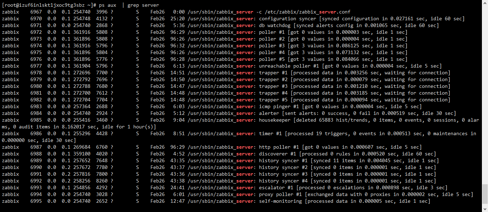
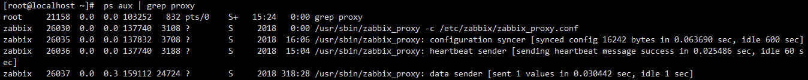

# Interview 02

1. Zabbix Server 的子进程的作用[^1]

   

   - `configuration syncer`：配置同步器，将配置文件中的信息同步到内存中缓存
   - `db watchdog`：数据库看门狗，监视 Zabbix 系统的数据库状态，当数据库状态变为不可用时，发送报警信息（*Zabbix Proxy 不支持这类型进程*）
   - `poller`：轮询器，普通的被动监控的轮询
   - `unreachable poller`：不可到达轮询器，轮询不可到达的设备
   - `trapper`：捕捉器[^2]，接收传入的数据，而不是查询它
   - `icmp pinger`：ping 检查器，定期进行 ICMP PING 检查
   - `alerter`：报警器，发送报警通知
   - `housekeeper`：管家，清理过期的历史数据
   - `timer`：定时器，处理触发器中与时间有关的函数， Zabbix 维护模式
   - `http poller`：HTTP 轮询器，轮询 WEB 类的监控项目
   - `discoverer`：自动发现器，自动发现设备
   - `history syncer`：历史数据同步器，写历史数据表
   - `escalator`：步骤，处理动作中的步骤
   - `proxy poller`：代理轮询，Proxy 的被动轮询
   - `self-monitoring`：自我监控，收集 Zabbix 系统内部的监控信息

   

   - `heartbeat sender`：心跳发送器，Proxy 向 Server 发送心跳信息（*Zabbix Server 没有这类型进程*）
   - `data sender`：数据发送器，Proxy 向 Server 发送数据

   ---

2. Zabbix 的主动模式和被动模式[^3]

   - 主动模式是 Zabbix Agent  请求主动的监控项列表，并主动向 Server/Proxy 发送数据

   - 被动模式是 Server 向 Agent 获取监控项的数据，Agent 返回数据。

   - 配置主动模式

     1. Agent Conf 配置

        ```bash
        # 如果纯主动模式，注释这一条
        #Server=1.1.1.1
        # zabbix_agentd 被动模式 pre-forked 实例数
        # 0，表示禁用被动模式，agent 将不会侦听任何 TCP 端口
        StartAgents=0
        # 主动模式的 Server IP
        ServerActive=1.1.1.1
        # Agent 主机名
        Hostname=active_test
        ```

     2. WEB 添加主动模式监控模板[^4]

   ---

3. TCP 的概念，关于各个状态，如 Establish， Listen 等[^5]

   1. TCP 的全称为传输控制协议，提供面向连接的、可靠的、点到点的通信。

   2. Listen ：服务器端的某个 SOCKET 处于监听状态，等待连接

   3. ESTABLISHED：打开的连接，双方可以进行或已经在数据交互

   4. [TCP的三次握手与四次挥手](https://github.com/opsxin/markdown-notes/blob/master/Other/TCP/TCP的三次握手与四次挥手.md)

   5. TIME_WAIT 状态需要等 2MSL 后才 CLOSED

      > 虽然双方都同意关闭连接了，而且握手的 4 个报文也都协调和发送完毕，按理可以直接回到 CLOSED状态（就好比从 SYN_SEND 状态到 ESTABLISH 状态那样），但是因为我们必须要假想网络是不可靠的，你无法保证你最后发送的 ACK 报文会一定被对方收到，因此对方处于 LAST_ACK 状态下的SOCKET 可能会因为超时未收到 ACK 报文，而重发 FIN 报文，所以这个 TIME_WAIT 状态的作用就是用来重发可能丢失的 ACK 报文。

   ---

4. 虚拟化，[KVM](https://zh.wikipedia.org/wiki/%E5%9F%BA%E4%BA%8E%E5%86%85%E6%A0%B8%E7%9A%84%E8%99%9A%E6%8B%9F%E6%9C%BA)，[Xen](https://zh.wikipedia.org/wiki/Xen)，[OVZ](https://zh.wikipedia.org/wiki/OpenVZ)

   1. [硬件虚拟化](https://zh.wikipedia.org/wiki/%E7%A1%AC%E4%BB%B6%E8%99%9A%E6%8B%9F%E5%8C%96)、[操作系统层虚拟化](https://zh.wikipedia.org/wiki/%E4%BD%9C%E6%A5%AD%E7%B3%BB%E7%B5%B1%E5%B1%A4%E8%99%9B%E6%93%AC%E5%8C%96)、[桌面虚拟化](https://zh.wikipedia.org/wiki/%E6%A1%8C%E9%9D%A2%E8%99%9A%E6%8B%9F%E5%8C%96)、[沙盒](https://zh.wikipedia.org/wiki/%E6%B2%99%E7%9B%92_(%E9%9B%BB%E8%85%A6%E5%AE%89%E5%85%A8))
   2. [维基百科：虚拟化](https://zh.wikipedia.org/wiki/虛擬化)
   3. [KVM的使用](https://github.com/opsxin/markdown-notes/blob/master/KVM/KVM%E7%9A%84%E4%BD%BF%E7%94%A8.md)

   ---

5. iptables 的四表五链，五链的顺序

   1. 四表：filter、nat、managle、raw
   2. 五链：PreRouting、INPUT、Forwarding、OUTPUT、PostRouting
   3. 顺序
      - PreRouting–>INPUT–>OUTPUT–>PostRouting
      - PreRouting–>Forwarding–>PostRouting
   4. [iptables详细](https://github.com/opsxin/markdown-notes/blob/master/Linux/iptables/iptables-1-介绍.md)

   ---

6. Pod 的概念

   1. > Pod[^6]是一组一个或多个容器（如 Docker 容器），具有共享存储/网络，以及如何运行容器的规范。 Pod 的容器（Contents）始终位于同一位置并共同调度，并共享上下文中。 Pod 模仿（Models）特定应用程序的“逻辑主机” -- 它包含一个或多个相对紧密耦合的应用程序容器 –- 在预容器（pre-container）世界中，被执行在相同物理或虚拟机上意味着在同一逻辑主机上执行。

   2. Pod 是最小的管理、创建、计划单元

   3. [Pod-k8s in action](https://github.com/opsxin/markdown-notes/blob/master/K8S/kubernetes-in-action/k8s-03-Pod.md)

   ---

7. VLAN 概念，作用

   1. > **虚拟区域**[^7]（**Virtual Local Area Network**或简写**VLAN**, **V-LAN**）是一种建构于局域网交换技术（LAN Switch）的[网络管理](https://zh.wikipedia.org/wiki/網絡管理)的技术，网管人员可以借此透过控制[交换机](https://zh.wikipedia.org/wiki/交換器)有效分派出入局域网的分组到正确的出入端口，达到对不同实体局域网中的设备进行逻辑分群（Grouping）管理，并降低局域网内大量数据流通时，因无用分组过多导致壅塞的问题，以及提升局域网的信息安全保障。

   2. 作用

      - 广播控制
      - 带宽利用
      - 降低延迟
      - 安全性

   3. 相关了解

      - [XVLAN](https://docs.oracle.com/cd/E19285-01/html/E26513/13_XVLAN.html)，单臂路由，VLANIF

   ---

8. 软链和硬链接，跨文件系统，inode

   1. > 文件都有文件名与数据，这在 Linux 上被分成两个部分：用户数据 (user data) 与元数据 (metadata)。
      >
      > 用户数据，即文件数据块 (data block)，数据块是记录文件真实内容的地方。
      >
      > 元数据则是文件的附加属性，如文件大小、创建时间、所有者等信息。
      >
      > 在 Linux 中，元数据中的 inode 号（inode 是文件元数据的一部分但其并不包含文件名，inode 号即索引节点号）才是文件的唯一标识而非文件名。文件名仅是为了方便人们的记忆和使用，系统或程序通过 inode 号寻找正确的文件数据块。

   2. 若一个 inode 号对应多个文件名，则称这些文件为硬链接。换言之，硬链接就是同一个文件使用了多个别名

   3. 若文件用户数据块中存放的内容是另一文件的路径名的指向，则该文件就是软连接。软链接就是一个普通文件，只是数据块内容有点特殊。软链接有着自己的 inode 号以及用户数据块

   4. 硬链接特性：

      - 文件有相同的 inode 及 data block；
      - 只能对已存在的文件进行创建；
      - 不能交叉文件系统进行硬链接的创建；
      - 不能对目录进行创建，只可对文件创建；
      - 删除一个硬链接文件并不影响其他有相同 inode 号的文件。

   5. 软链接特性：

      - 软链接有自己的文件属性及权限等；
      - 可对不存在的文件或目录创建软链接；
      - 软链接可交叉文件系统；
      - 软链接可对文件或目录创建；
      - 创建软链接时，链接计数 i_nlink 不会增加；
      - 删除软链接并不影响被指向的文件，但若被指向的原文件被删除，则相关软连接被称为死链接（即 dangling link，若被指向路径文件被重新创建，死链接可恢复为正常的软链接）。

> [^1]:[Zabbix server 进程说明](https://blog.51cto.com/weadyweady/1702520)
> [^2]:[Zabbix trapper方式监控](https://blog.51cto.com/ityunwei2017/1895003)
> [^3]: [Zabbix主动模式和被动模式](https://blog.51cto.com/zengestudy/1792018)
> [^4]:[监控利器Zabbix之主动模式和被动模式](https://www.centos.bz/2018/01/监控利器zabbix之主动模式和被动模式/)
> [^5]: [TCP/IP详解--TCP/IP连接各个状态转换分析](https://blog.csdn.net/yusiguyuan/article/details/39375729)
> [^6]:[Pods](https://kubernetes.io/docs/concepts/workloads/pods/pod/)
> [^7]:[维基百科：虚拟局域网]([https://zh.wikipedia.org/wiki/%E8%99%9A%E6%8B%9F%E5%B1%80%E5%9F%9F%E7%BD%91](https://zh.wikipedia.org/wiki/虚拟局域网))
> [^8]:[理解 Linux 的硬链接与软链接](https://www.ibm.com/developerworks/cn/linux/l-cn-hardandsymb-links/index.html)
