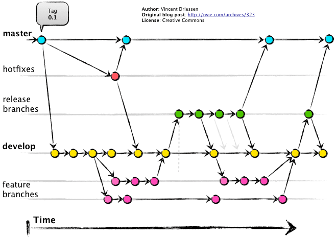
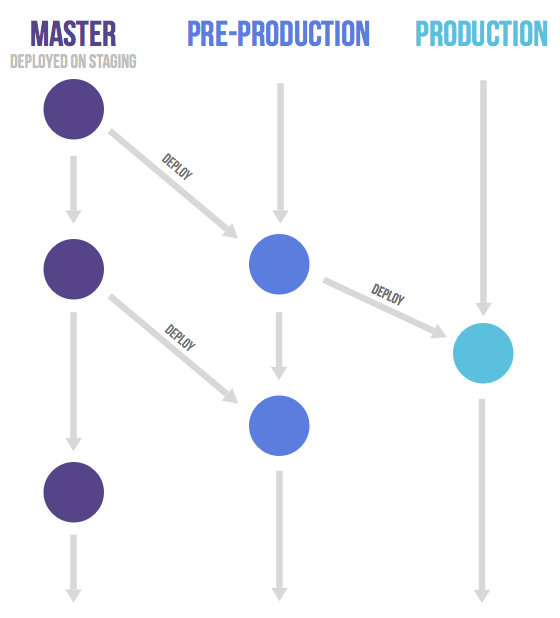

# 各个 Git Flow 的优缺点

Git Flow，Github Flow 和 Gitlab Flow 的特点及优缺点。

## Git Flow

### 特点

- 两个长期分支：master 和 develop
- 三个短期分支：feature(功能)、hotfix(补丁)、release(预发)

### 优点

- 各个 feature 之间代码隔离，可以独立开发、测试，分支清晰
- 当 feature 开发周期长于 release 周期，可以避免未完成的 feature 进入生产环境

### 缺点

- 分支开发时间较长时，开发成本较高。可能新创建的分支会基于错的代码进行开发
- 当部署较频繁时，没必要同时维护两个分支
- 分支较多时，合并代码时容易存在冲突
- 规则较多，学习成本相对来说会高一些

### 应用场景

- 需要支持多个版本的软件并且相互独立
- 多版本独立，同时后续各版本开发

## Github Flow

### 特点

- 只有一个 master 分支为长期分支
- anything in the master branch is always deployable。只要在 master 分支中的代码一定是可以部署的
- 新建的分支名称需体现此分支的作用

### 优点

- 规则简单

### 缺点

- master 合并后如果不发布，会造成线上和 master 不一致

### 应用场景

- 需要频繁部署，且立即部署的项目
- 适合小型项目，开发人员少的项目

## Gitlab Flow

### 特点

- master 为主分支
- 拥有环境分支 pre-production(预发分支)、production(生产分支)

### 优点

- 清晰可控
- 规则相对 git flow 来说更简单

### 缺点

- 相对于 github flow 来说，gitlab flow 更复杂
- 当维护较多版本时，会变得像 git flow 似的比较复杂

### 应用场景

- 需要进行预发布的项目
- gitlab 推荐的工作流方式

> [gitflow & github flow & gitlab flow](https://juejin.im/post/5b83c68751882542c56ca498)