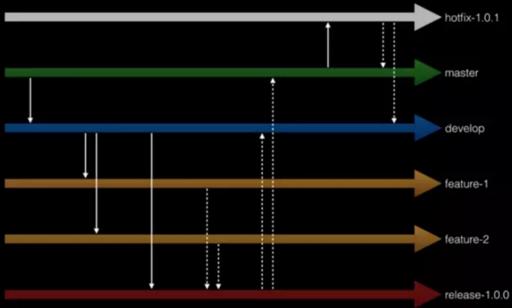

# Git Flow 模型

## 介绍

我们都知道， 在 git 的分支功能相对 svn 确实方便许多，而且也非常推荐使用分支来做开发。我的做法是每个项目都有 2 个分支，master 和 develop。 master 分支是主分支，保证程序有一个稳定版本，develop 则是开发用的分支， 几乎所有的功能开发， bug 修复都在这个分支上， 完成后再合并回 master。

但是情况并不是这么简单。 有时当我们正在开发一个功能， 但程序突然出现 bug 需要及时去修复的时候，这时要切回 master 分支， 并基于它创建一个 hotfix 分支。 有时我们在开发一个功能时， 需要停下来去开发另一个功能。 而且所有这些问题都出现的时候，发布也会成为比较棘手问题。

也就是说， git branch 功能很强大，但是没有一套模型告诉我们应该怎样在开发的时候善用这些分支。而 Git Flow 模型就是要告诉我们怎么更好地使用 Git 分支。

简单来说，git-flow 就是在 git branch git tag 基础上封装出来的代码分支管理模型，把实际开发模拟成 master develop feature release hotfix support 几种场景，其中 master 对应发布上线，develop 对应开发，其他几个在不同的情况下出现。通过封装，git-flow 屏蔽了 git branch 等相对来说比较复杂生硬的命令，简单而且规范的解决了代码分支管理问题。

**简单来说, Git Flow 将 branch 分成 2 个主要分支和 3 个临时的辅助分支：**


### 主要分支

master: 永远处在==即将发布(production-ready)状态==

develop: ==最新的开发状态==

### 辅助分支

feature: ==开发新功能的分支，基于 develop==，完成后 ==merge 回 develop==

release: ==准备要发布版本的分支, 用来修复 bug，基于 develop==，完成后 ==merge 回 develop 和 master==

hotfix: ==修复 master 上的问题==。等不及 release 版本就必须马上上线。==基于 master==，完成后 ==merge 回 master 和 develop==

## 使用

### 安装

```bash
apt install git-flow
```

在一个全新目录下构建 git-flow 模型：

```bash
git flow init
```

接着它会问你一系列的问题，蛋定！尽量使用它的默认值就好了：

```bash
No branches exist yet. Base branches must be created now.
Branch name for production releases: [master]
Branch name for "next release" development: [develop]
How to name your supporting branch prefixes?
Feature branches? [feature/]
Release branches? [release/]
Hotfix branches? [hotfix/]
Support branches? [support/]
Version tag prefix? []
```

或者在现有的版本库构建：

```bash
$ git flow init
Which branch should be used for bringing forth production releases?
   - master
Branch name for production releases: [master]
Branch name for "next release" development: [develop]

How to name your supporting branch prefixes?
Feature branches? [feature/]
Release branches? [release/]
Hotfix branches? [hotfix/]
Support branches? [support/]
Version tag prefix? []
```

### 场景

#### 新功能开发，代号 f1

1. 基于develop，开启新功能分支开发

   成前面构建操作，当前所在分支就变成 develop. 任何开发都必须从 develop 开始：

   ```bash
   git flow feature start f1
   ```

   git-flow 从 develop 分支创建了一个新的分支 feature/f1，并自动切换到这个分支下面。然后就可以进行 f1 功能开发，中间可以多次的 commit 操作。

   将一个 f1 分支推到远程服务器，与其他开发人员协同开发：

   ```bash
   git flow feature publish f1
   ```

   或者

   ```bash
   git push origin feature/f1
   ```

2. 完成功能开发，结束新功能分支并删除

   ```bash
   git flow feature finish f1
   ```

   feature/f1 分支的代码会被合并到 develop 里面，然后删除该分支，切换回 develop。到此，新功能开发这个场景完毕。在 f1 功能开发中，如果 f1 未完成，同时功能 f2 要开始进行，也是可以的。

#### 发布上线，代号 0.1

1. 基于develop，开发发布分支

   ```bash
   $ git flow release start 0.1
   Switched to a new branch 'release/0.1'

   Summary of actions:
   - A new branch 'release/0.1' was created, based on 'develop'
   - You are now on branch 'release/0.1'

   Follow-up actions:
   - Bump the version number now!
   - Start committing last-minute fixes in preparing your release
   - When done, run:

   git flow release finish '0.1'
   ```

2. git-flow 从 develop 分支创建一个新的分支 release/0.1，并切换到该分支下，接下来要做的就是修改版本号等发布操作

   ```bash
   $ git flow release finish 0.1
   Switched to branch 'master'
   Merge made by the 'recursive' strategy.
    f1      |    1 +
    version |    1 +
    2 files changed, 2 insertions(+)
    create mode 100644 f1
    create mode 100644 version
   Switched to branch 'develop'
   Merge made by the 'recursive' strategy.
    version |    1 +
    1 file changed, 1 insertion(+)
    create mode 100644 version
   Deleted branch release/0.1 (was d77df80).

   Summary of actions:
   - Latest objects have been fetched from 'origin'
   - Release branch has been merged into 'master'
   - The release was tagged '0.1'
   - Release branch has been back-merged into 'develop'
   - Release branch 'release/0.1' has been deleted
   ```

3. git-flow 会依次切换到 master develop 下合并 release/0.1 里的修改，然后用 git tag 的给当次发布打上 tag 0.1，可以通过 git tag 查看所有 tag

   ```bash
   $ git:(master) git tag
   0.1
   0.2
   ```

#### 紧急 bug 修正，代号 bug1

1. 基于master，开启热修复分支

   ```bash
   $ git flow hotfix start bug1
   Switched to a new branch 'hotfix/bug1'

   Summary of actions:
   - A new branch 'hotfix/bug1' was created, based on 'master'
   - You are now on branch 'hotfix/bug1'

   Follow-up actions:
   - Bump the version number now!
   - Start committing your hot fixes
   - When done, run:

   git flow hotfix finish 'bug1'
   ```

2. git-flow 从 master 分支创建一个新的分支 hotfix/bug1，并切换到该分支下。接下来要做的就是修复 bug

   ```bash
   $ git flow hotfix finish bug1
   Switched to branch 'master'
   Merge made by the 'recursive' strategy.
    f1 |    2 +-
    1 file changed, 1 insertion(+), 1 deletion(-)
   Switched to branch 'develop'
   Merge made by the 'recursive' strategy.
    f1 |    2 +-
    1 file changed, 1 insertion(+), 1 deletion(-)
   Deleted branch hotfix/bug1 (was aa3ca2e).

   Summary of actions:
   - Latest objects have been fetched from 'origin'
   - Hotfix branch has been merged into 'master'
   - The hotfix was tagged 'bug1'
   - Hotfix branch has been back-merged into 'develop'
   - Hotfix branch 'hotfix/bug1' has been deleted
   ```

   git-flow 会依次切换到 master develop 分支下合并 hotfix/bug1，然后删掉 hotfix/bug1。到此，hotfix 完成。

   > ==git-flow 的 feature release 都是从 develop 分支创建，hotfix support 都是从 master 分支创建。==

## 经典分支管理规范



1. 最稳定的代码放在 master 分支上（相当于 SVN 的 trunk 分支），我们不要直接在 master 分支上提交代码，只能在该分支上进行代码合并操作，例如将其它分支的代码合并到 master 分支上。
2. 我们日常开发中的代码需要从 master 分支拉一条 develop 分支出来，该分支所有人都能访问，但一般情况下，我们也不会直接在该分支上提交代码，代码同样是从其它分支合并到 develop 分支上去。
3. 当我们需要开发某个特性时，需要从 develop 分支拉出一条 feature 分支，例如 feature-1 与 feature-2，在这些分支上并行地开发具体特性。
4. 当特性开发完毕后，我们决定需要发布某个版本了，此时需要从 develop 分支上拉出一条 release 分支，例如 release-1.0.0，并将需要发布的特性从相关 feature 分支一同合并到 release 分支上，随后将针对 release 分支部署测试环境，测试工程师在该分支上做功能测试，开发工程师在该分支上修改 bug。
5. 待测试工程师无法找到任何 bug 时，我们可将该 release 分支部署到预发环境，再次验证以后，均无任何 bug，此时可将 release 分支部署到生产环境。
6. 待上线完成后，将 release 分支上的代码同时合并到 develop 分支与 master 分支，并在 master 分支上打一个 tag，例如 v1.0.0。
7. 当生产环境发现 bug 时，我们需要从对应的 tag 上（例如 v1.0.0）拉出一条 hotfix 分支（例如 hotfix-1.0.1），并在该分支上做 bug 修复。待 bug 完全修复后，需将 hotfix 分支上的代码同时合并到 develop 分支与 master 分支。

对于版本号我们也有要求，==格式为：x.y.z==，其中，x 用于有重大重构时才会升级，y 用于有新的特性发布时才会升级，z 用于修改了某个 bug 后才会升级。针对每个微服务，我们都需要严格按照以上开发模式来执行。

**与Git Flow模型分支管理的区别点：**

> 1. feature 分支开发完成后，暂时不合并至 develop，而是基于 develop 开启 release 分支，将 feature 分支合并到 release 分支，进行测试；
> 2. release 分支测试通过后，部署到生产环境，将 release 分支代码合并到 develop 分支与 master 分支，并在 master 分支打一个tag；
>
> [GIT版本管理：Git Flow模型](https://www.jianshu.com/p/62b4ebe283f3)
