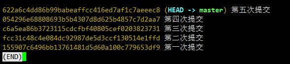
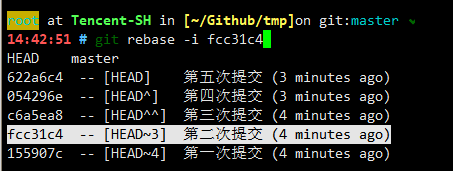
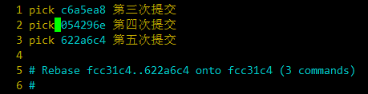
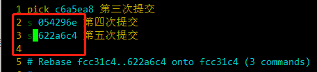
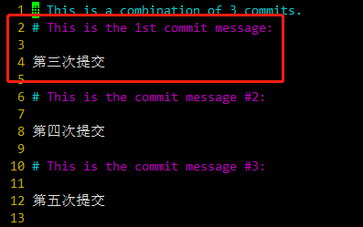
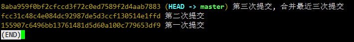
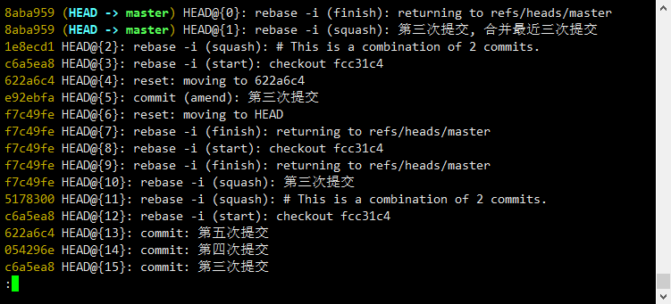
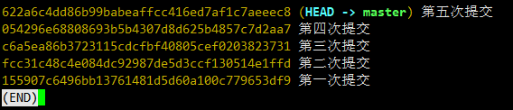

# Git 命令

在使用 Git 的过程中用到的一些命令，可能包含一些平时不常用的命令。

[TOC]

## 分支重命名

### 本地分支重命名

```bash
git branch -m <old_name> <new_name>
```

### 远程分支重命名

#### 删除远程分支

```bash
git push origin :<remote_branch_name>
```

#### 推送本地分支

```bash
git push origin <local_branch_name>:<remote_branch_name>
```

## 合并同一分支的 Commit

### 查看 Log

```bash
git log --pretty=oneline
```



### 合并最近三次的提交

```bash
git rebase -i fcc31c4
```



### 修改提交方式





#### 命令说明

```bash
# 命令:
# p, pick = 使用 commit
# r, reword = 使用 commit, 但是修改这个提交信息
# e, edit = 使用 commit, 修改这个 Commit 后，继续 rebase
# s, squash = 使用 commit, 但是会和上一个 Commit 合并
# f, fixup = 类似 "squash", 但是丢弃这个 Commit
# x, exec = 执行 Shell
# d, drop = 移除 commit
```

### 重新修改 Commit 信息

将会使用**红框**内的 commit 作为 Title。



### 重新查看 Log

```bash
git log --pretty=oneline
```

git_log2

### 其他 rebase 命令

```bash
# 出现冲突，先解决冲突，再继续 rebase
git add .
git rebase --continue

# 放弃本次 rebase
git rebase --abort
```

## 撤销 Git 操作

### 查看刷新日志（reflog）

```bash
git reflog
```



### 还原

```bash
# 例如本次还原 rebase
git reset --hard HEAD@{13}
```

### 查看 Commit Log

```bash
git log --pretty=oneline
```



## Git 免输用户名和密码

### SSH 协议

通过 SSH 协议和配置 Key，将公钥放置到 github 服务端。

### HTTPS 协议

#### 永久有效

```bash
git config --global credential.helper store
```

#### 保存有效期

```bash
git config --global credential.helper cache
git config --global credential.helper 'cache --timeout=3600'
```

## merge 合并

### no  fast forward

所有 commit 信息都会保留

```bash
git merge master --no-ff
```

### squash

所有 commit 合并成一个

```bash
git merge master --squash
```
