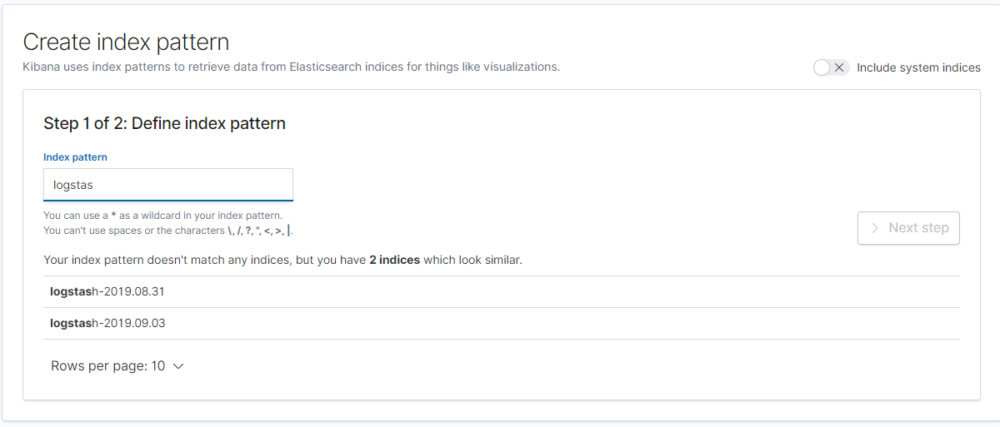
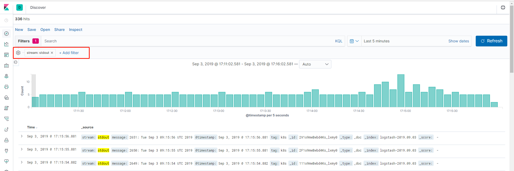

# 安装 EFK

**Elasticsearch[^1] **可以用于搜索各种文档。它提供**可扩展的搜索**，具有接近**实时的搜索**，并支持多租户。Elasticsearch 是**分布式**的，这意味着索引可以被分成分片，每个分片可以有 0 个或多个副本。每个节点托管一个或多个分片，并充当协调器将操作委托给正确的分片，再平衡和路由是自动完成的。相关数据通常存储在同一个索引中，该索引由一个或多个主分片和零个或多个复制分片组成。一旦创建了索引，就不能更改主分片的数量。

**Fluentd** 是一个开源数据收集器，在 Kubernetes 集群节点上安装 Fluentd，通过获取容器日志文件、过滤和转换日志数据，然后将数据传递到 Elasticsearch 集群，在该集群中对其进行索引和存储。

**Kibana** 是一个数据可视化 Dashboard。

[TOC]

## 创建 Elasticsearch 集群

```yaml
# 创建命名空间
apiVersion: v1
kind: Namespace
metadata:
  name: efk

---
# 创建 Service，用于在集群内访问
# 相同命名空间使用 `.efk-svc` 访问
# 不同命名空间使用 `.efk-svc.efk.svc.cluster.local` 访问
apiVersion: v1
kind: Service
metadata:
  name: efk-svc
  namespace: efk
spec:
  selector:
    app: elasticsearch
  clusterIP: None
  ports:
    - port: 9200
      name: rest-port
    - port: 9300
      name: inter-node

---
apiVersion: apps/v1
kind: StatefulSet
metadata:
  name: es-cluster
  namespace: efk
spec:
  replicas: 3
  revisionHistoryLimit: 10
  selector:
    matchLabels:
      app: elasticsearch
  serviceName: efk-svc
  template:
    metadata:
      labels:
        app: elasticsearch
    spec:
      containers:
      - env:
        - name: cluster.name
          value: es-cluster
        - name: node.name
          valueFrom:
            fieldRef:
              fieldPath: metadata.name
        # ES7 `discovery.zen.ping.unicast.hosts` 修改为 `discovery.seed_hosts`
        - name: discovery.seed_hosts
          value: es-cluster-0.efk-svc,es-cluster-1.efk-svc,es-cluster-2.efk-svc
        # 集群自主控制，`cluster.initial_master_nodes` 初始化集群列表
        # es-cluster-{0..2} 为 StatefulSet 的 Pod 名
        - name: cluster.initial_master_nodes
          value: es-cluster-0,es-cluster-1,es-cluster-2
        - name: ES_JAVA_OPTS
          value: -Xms512m -Xmx512m
        image: docker.elastic.co/elasticsearch/elasticsearch:7.3.1
        imagePullPolicy: IfNotPresent
        name: elasticsearch
        ports:
        - containerPort: 9200
          name: rest-port
        - containerPort: 9300
          name: inter-node
        resources:
          limits:
            cpu: 200m
            memory: 1G
          requests:
            cpu: 100m
            memory: 512M
        volumeMounts:
        - mountPath: /usr/share/elasticsearch/data
          name: es-data
      initContainers:
      # 修复文件夹权限
      # 容器用户和组为 ‘1000’， 因此需要对文件夹及文件有读写权限
      - command: ["sh", "-c", "chown -R 1000:1000 /usr/share/elasticsearch/data"]
        image: busybox
        name: fix-permissions
        securityContext:
          privileged: true
        volumeMounts:
        - mountPath: /usr/share/elasticsearch/data
          name: es-data
      - command: ["sysctl", "-w", "vm.max_map_count=262144"]
        image: busybox
        name: increase-vm-max-map
        securityContext:
          privileged: true
      - command: ["sh", "-c", "ulimit -n 65536"]
        image: busybox
        name: increase-fd-ulimit
        securityContext:
          privileged: true
      restartPolicy: Always
  # 卷声明
  # 此处使用 [NFS-Client](https://github.com/kubernetes-incubator/external-storage/tree/master/nfs-client)
  volumeClaimTemplates:
  - metadata:
      annotations:
        volume.beta.kubernetes.io/storage-class: managed-nfs-storage
      labels:
        app: elasticsearch
      name: es-data
    spec:
      accessModes:
      - ReadWriteOnce
      resources:
        requests:
          storage: 200M
```

部署 YAML

```bash
kubectl apply -f . --record
# 查看运行后的 Pod
kubectl get pod -o wide -n efk
```

查看是否启动成功

```bash
curl http://$(上一步得到的 Pod IP)/_cluster/state?pretty
```

如果成功，将会显示集群信息

```json
{
  "cluster_name" : "es-cluster",
  "cluster_uuid" : "y2MKTMM1RDKUE1DBLAG0dw",
  "version" : 68,
  "state_uuid" : "1VO-hQ8lQQajVXj01ZJviw",
  # 主节点为 es-cluster-1
  "master_node" : "m1nf8dcxQZCn9WNXBT2byg",
  "blocks" : { },
  "nodes" : {
    "Ew8tMD0OQXqKI_jWbVOiGQ" : {
      "name" : "es-cluster-2",
      "ephemeral_id" : "Iz5LuM-wTDC-1D4YGt7MGA",
      "transport_address" : "10.244.2.44:9300",
      "attributes" : {
        "ml.machine_memory" : "999997440",
        "ml.max_open_jobs" : "20",
        "xpack.installed" : "true"
      }
    },
    "_G0-vF33T22HavljY585NA" : {
      "name" : "es-cluster-0",
      "ephemeral_id" : "p7_OCSuIS2GZ6f7zGobG2g",
      "transport_address" : "10.244.2.45:9300",
      "attributes" : {
        "ml.machine_memory" : "999997440",
        "ml.max_open_jobs" : "20",
        "xpack.installed" : "true"
      }
    },
    "m1nf8dcxQZCn9WNXBT2byg" : {
      "name" : "es-cluster-1",
      "ephemeral_id" : "EgOGVaLQQTmaQ1zoXaDI4A",
      "transport_address" : "10.244.1.232:9300",
      "attributes" : {
        "ml.machine_memory" : "999997440",
        "ml.max_open_jobs" : "20",
        "xpack.installed" : "true"
      }
    }
  },
...
```

## 创建 Kibana 服务

```yaml
apiVersion: extensions/v1beta1
kind: Deployment
metadata:
  labels:
    app: kibana
  name: kibana
  namespace: efk
spec:
  replicas: 1
  revisionHistoryLimit: 10
  selector:
    matchLabels:
      app: kibana
  template:
    metadata:
      labels:
        app: kibana
    spec:
      containers:
      - env:
        # Kibana7 修改 `ELASTICSEARCH_URL` 为 `ELASTICSEARCH_HOSTS`
        # efk-svc 就是上一步的 Es 集群服务
        - name: ELASTICSEARCH_HOSTS
          value: http://efk-svc:9200
        image: docker.elastic.co/kibana/kibana:7.3.1
        imagePullPolicy: IfNotPresent
        name: kibana
        ports:
        - containerPort: 5601
          name: kibana-port
        resources:
          limits:
            cpu: 200m
            memory: 512M
          requests:
            cpu: 100m
            memory: 200M
      restartPolicy: Always

---
apiVersion: v1
kind: Service
metadata:
  name: kibana-svc
  namespace: efk
  labels:
    app: kibana
spec:
  type: NodePort
  ports:
    - port: 5601
      targetPort: kibana-port
  selector:
    app: kibana
```

## 部署 Fluentd

### 创建 RBAC

```yaml
# Fluentd 的服务账号
apiVersion: v1
kind: ServiceAccount
metadata:
  name: fluentd
  namespace: efk

---
apiVersion: rbac.authorization.k8s.io/v1
kind: ClusterRole
metadata:
  name: fluentd
rules:
  - apiGroups: [""]
    resources: ["namespaces", "pods"]
    verbs: ["get", "list", "watch"]

---
apiVersion: rbac.authorization.k8s.io/v1
kind: ClusterRoleBinding
metadata:
  name: fluentd
subjects:
  - kind: ServiceAccount
    name: fluentd
    namespace: efk
roleRef:
  kind: ClusterRole
  name: fluentd
  apiGroup: rbac.authorization.k8s.io
```

### 创建 ConfigMap

[~~fluentd-es-configmap.yaml~~](https://github.com/kubernetes/kubernetes/blob/master/cluster/addons/fluentd-elasticsearch/fluentd-es-configmap.yaml)

```yaml
apiVersion: v1
kind: ConfigMap
metadata:
  name: fluentd-cm
  namespace: efk
data:
  system.conf: |-
    <system>
      root_dir /tmp/fluentd-buffers
    </system>
  
  containers.input.conf: |-
    <source>
     @id fluentd-contain.log
     @type tail
     path /var/log/containers/*.log
     pos_file /var/log/es-containers.log.pos
     tag raw.k8s
     read_from_head true
     <parse>
      @type multi_format
        <pattern>
          format json
          time_key time
          time_format %Y-%m-%dT%H:%M:%S.%NZ
        </pattern>
        <pattern>
          format /^(?<time>.+) (?<stream>stdout|stderr) [^ ]* (?<log>.*)$/
          time_format %Y-%m-%dT%H:%M:%S.%N%:z
        </pattern>
     </parse>
    </source>

    # 检测日志输出中的异常并将其作为一个日志条目转发
    <match raw.k8s.**>
      @id raw.kubernetes
      @type detect_exceptions
      remove_tag_prefix raw
      message log
      stream stream
      multiline_flush_interval 5
      max_bytes 500000
      max_lines 1000
    </match>

    # 合并多行日志
    <filter **>
      @id filter_concat
      @type concat
      key message
      multiline_end_regexp /\n$/
      separator ""
    </filter>

    # 用 Kubernetes 元数据丰富记录
    <filter k8s.**>
      @id filter_kubernetes_metadata
      @type kubernetes_metadata
    </filter>

    # 修复 Json 字段
    <filter k8s.**>
      @id filter_parser
      @type parser
      key_name log
      reserve_data true
      remove_key_name_field true
      <parse>
        @type multi_format
        <pattern>
          format json
        </pattern>
        <pattern>
          format none
        </pattern>
      </parse>
    </filter>

  system.input.conf: |-
    # I1118 21:26:53.975789       6 proxier.go:1096] Port "nodePort for kube-system/default-http-backend:http" (:31429/tcp) was open before and is still needed
    <source>
      @id kube-proxy.log
      @type tail
      format multiline
      multiline_flush_interval 5s
      format_firstline /^\w\d{4}/
      format1 /^(?<severity>\w)(?<time>\d{4} [^\s]*)\s+(?<pid>\d+)\s+(?<source>[^ \]]+)\] (?<message>.*)/
      time_format %m%d %H:%M:%S.%N
      path /var/log/containers/kube-proxy-*.log
      pos_file /var/log/es-kube-proxy.log.pos
      tag kube-proxy
    </source>

    # systemd 管理的日志
    <source>
      @id journald-docker
      @type systemd
      matches [{ "_SYSTEMD_UNIT": "docker.service" }]
      <storage>
        @type local
        persistent true
        path /var/log/journald-docker.pos
      </storage>
      read_from_head true
      tag docker
    </source>
    <source>
      @id journald-kubelet
      @type systemd
      matches [{ "_SYSTEMD_UNIT": "kubelet.service" }]
      <storage>
        @type local
        persistent true
        path /var/log/journald-kubelet.pos
      </storage>
      read_from_head true
      tag kubelet
    </source>
  output.conf: |-
    # 输出到 ES 集群
    <match **>
      @id elasticsearch
      @type elasticsearch
      @log_level info
      type_name _doc
      include_tag_key true
      # 集群 Service
      host efk-svc
      port 9200
      logstash_format true
      <buffer>
        @type file
        path /var/log/fluentd-buffers/kubernetes.system.buffer
        flush_mode interval
        retry_type exponential_backoff
        flush_thread_count 2
        flush_interval 5s
        retry_forever
        retry_max_interval 30
        chunk_limit_size 2M
        queue_limit_length 8
        overflow_action block
      </buffer>
    </match>
```

### 创建 DaemonSet

```yaml
# [fluentd-es-ds.yaml](https://github.com/kubernetes/kubernetes/blob/master/cluster/addons/fluentd-elasticsearch/fluentd-es-ds.yaml)
apiVersion: apps/v1
kind: DaemonSet
metadata:
  name: fluentd
  namespace: efk
  labels:
    app: fluentd
spec:
  selector:
    matchLabels:
      app: fluentd
  template:
    metadata:
      labels:
        app: fluentd
    spec:
      serviceAccountName: fluentd
      containers:
      - name: fluentd
        image: quay.io/fluentd_elasticsearch/fluentd:v2.7.0
        env:
          - name:  FLUENT_ARGS
            value: --no-supervisor -q
          # Fluent 启动用户为 root
          # 防止有些文件无权限读
          - name: FLUENT_UID
            value: "0"
        resources:
          limits:
            memory: 500Mi
          requests:
            cpu: 100m
            memory: 200Mi
        volumeMounts:
        - name: varlog
          mountPath: /var/log
        - name: varlibdockercontainers
          mountPath: /var/lib/docker/containers
          readOnly: true
        - name: config-volume
          mountPath: /etc/fluent/config.d
      volumes:
      - name: varlog
        hostPath:
          path: /var/log
      # Docker 日志真实的存储路径，必须也挂载
      - name: varlibdockercontainers
        hostPath:
          path: /var/lib/docker/containers
      - name: config-volume
        configMap:
          name: fluentd-cm
```

## Kibana 添加展示

### 创建索引



### 创建测试 Pod

```yaml
apiVersion: v1
kind: Pod
metadata:
  name: counter
  namespace: efk
spec:
  containers:
  - name: count
    image: busybox
    args: [/bin/sh, -c,
            'i=0; while true; do echo "$i: $(date)"; i=$((i+1)); sleep 1; done']
```

### 过滤显示测试 Pod 的日志



> 1. [^1]: [Elasticsearch](https://zh.wikipedia.org/wiki/Elasticsearch)
>
> 2. [ELK系列——7.0.0 elasticsearch 集群部署踩坑记（四）](https://blog.csdn.net/qq_40384985/article/details/89814501)
>
> 3. [在 Kubernetes 上搭建 EFK 日志收集系统](https://www.qikqiak.com/post/install-efk-stack-on-k8s/)
>
> 4. [fluentd-elasticsearch](https://github.com/kubernetes/kubernetes/tree/master/cluster/addons/fluentd-elasticsearch)
>
> 5. [Fluent Doc](https://docs.fluentd.org/v/0.12/)
