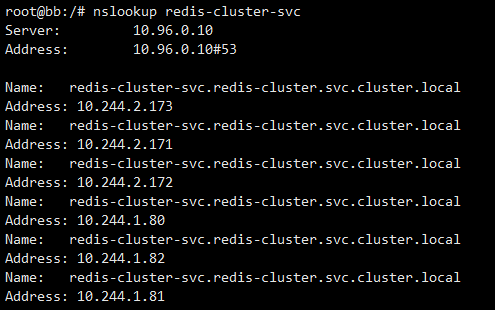
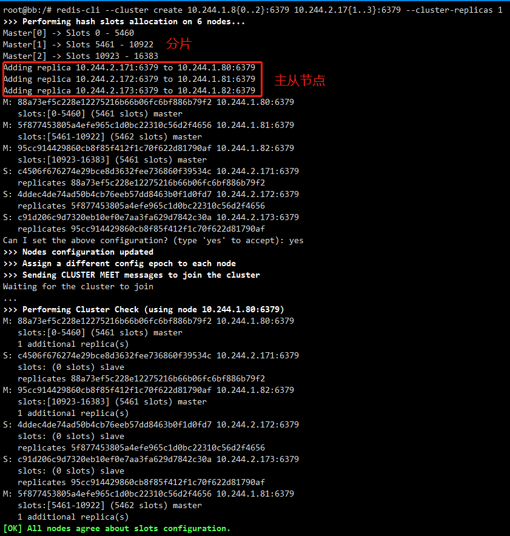
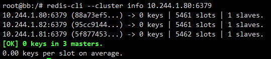
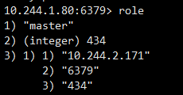
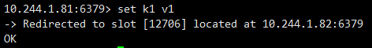
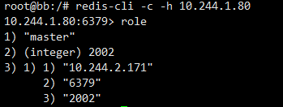
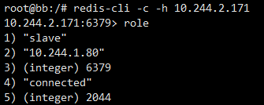
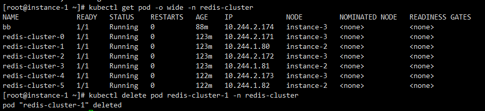
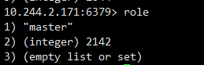

# Redis 集群部署

Redis 集群是一个可以在多个 Redis 节点之间进行数据共享的设施（installation）。

[TOC]

## Redis 配置文件

创建 `redis.conf` 配置文件

```yaml
# 开启 AOF
appendonly yes
# 开启集群
cluster-enabled yes
# 集群配置文件
cluster-config-file nodes.conf
# 集群节点间超时时间
cluster-node-timeout 5000
```

## Headless Service

```yaml
apiVersion: v1
kind: Service
metadata:
  name: redis-cluster-svc
  namespace: redis-cluster
spec:
  selector:
    app: redis-cluster
  ports:
  - port: 6379
  # 不设置集群 IP 
  clusterIP: None
```

## 开始 Redis Standalone

```yaml
...
  command: ["redis-server"]
  # 使用自定义的 redis.conf
  args: ["/usr/local/etc/redis/redis.conf"]
  volumeMounts:
    - name: cluster-cm
      mountPath: /usr/local/etc/redis
volumes:
  - name: cluster-cm
    configMap:
      # redis.conf 的 ConfigMap
      name: redis-cluster-cm
...
```

## 初始化集群

### 运行临时 Pod

```bash
kubectl run -it debian-tmp --image=debian --restart=Never --rm=true bash -n redis-cluster
```

### 安装软件

```bash
# dnsutils 提供 nslookup 和 dig 等工具
# redis-tools 提供 redis-cli 等
apt update && apt install -y dnsutils redis-tools
```

### 获取 Redis 的 IP

```bash
# redis-cluster-svc 为 Service 名
# 因为在同一命名空间（namespace），所以不需要完整 svc 名
nslookup redis-cluster-svc
```



```bash
# 单独获取 Pod 的 IP
# redis-cluster-0 为 Pod 名
nslookup redis-cluster-0
```

### 创建集群

本次使用的 Redis 的版本大于 5，因此直接使用 `redis-cli` 即可。版本小于 5 的，使用 `redis-trib`。

```bash
# cluster-replicas 表示集群中的每个主节点创建一个从节点
# 因为使用 Headless svc 的方式，找不到 Pod IP，所以直接使用上一步操作的 IP。~~暂时不清楚为什么无头服务会有问题。~~
# [可能 kube-dns 版本过低](https://github.com/kubernetes/kubernetes/issues/45779)，已解决
# 如果使用 Headless Service
#redis-cli --cluster create redis-cluster-{0..5}:6379 --cluster-replicas 1
redis-cli --cluster create 10.244.1.8{0..2}:6379 10.244.2.17{1..3}:6379 --cluster-replicas 1
```



## 查看集群信息

```bash
redis-cli --cluster info 10.244.1.80:6379
```



## 操作集群

```bash
redis-cli -c -h 10.244.1.80
# 查看节点当前角色
10.244.1.80 > role
```



集群会自动按照算法将 key 放到合适的节点上。



## 测试主从切换

### master 1 角色



### Node 1 角色



### 停止 Master 1

```bash
# Master 1 对应的 Pod Name
kubectl delete pod redis-cluster-1 -n redis-cluster
```



### 查看 Node 1 当前的角色

Slave 角色已变成 Master。



## 详细 YAML 文件

[Redis-Cluster](https://github.com/opsxin/k8s-yaml/tree/master/Redis-Cluster)

- 使用了 [NFS-Client](https://github.com/opsxin/k8s-yaml/tree/master/NFS-Client)，以持久化保存文件。

<br/>

> [Redis集群的原理和搭建](https://www.jianshu.com/p/c869feb5581d)
>
> [在K8S上搭建Redis集群](https://juejin.im/post/5c989ff2f265da60f206ffe4)
>
> [从零开始搭建Kubernetes集群（六、在K8S上部署Redis 集群）](https://www.jianshu.com/p/65c4baadf5d9)
