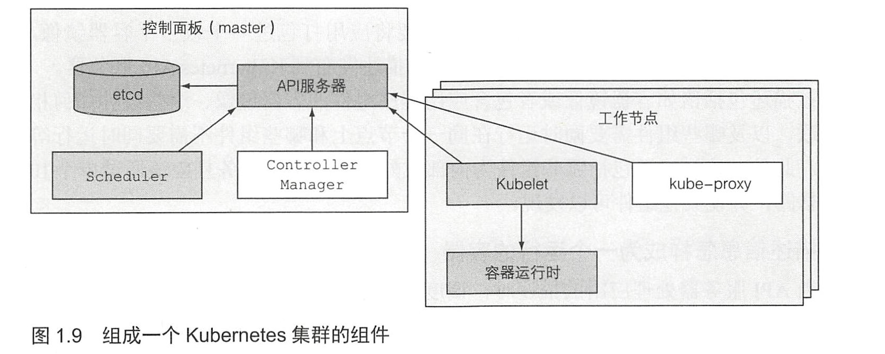

1. 单体应用：由**很多个组件**组成，这些组件**紧密的耦合**在一起，由于他们在同一个操作系统进程中运行，所以在开发、部署、管理都必须在同一个实体进行。即使市某个组件中小的更改，都需要重新部署整个应用。组件
   间缺乏严格的边界定义，相互依赖，日积月累导致系统复杂度提升。

2. 微服务：将复杂的大型单体应用，拆分为小的**可独立部署的微服务组件**。每个微服务以**独立的进程**运行，并通过简单且定义良好的接口（API）与其他的微服务通信。服务之间通过类似 HTTP 这样的同步协议通信，或者通过 AMQP（[高级消息队列协议](https://zh.wikipedia.org/wiki/高级消息队列协议)） 这样的异步协议通信。 

   只要API 不变或者向前兼容，改动一个微服务，并不会要求对其他微服务进行改动或者重新部署。

   缺点：1. 当组件数量增加时，部署相关的决定就变得越来越困难，因为不仅组件部署的组合数在增加，而且组件问依赖的组合数也在以更大的因素增加。2. 因为跨了多个进程和机器，使得调试代码和定位异常调用变得困难。3. 多个应用在同一个主机上运行可能会有依赖冲突。

3. Linux 命名空间（namespace）：每个进程只看到它自己的系统视图（文件、进程、网络接口、主机名等）。

   - Mount（mnt）
   - Process ID（pid）
   - Network（net）：运行在进程里的应用程序能看见什么网络接口。
   - Inter-process communication（ipd）
   - UTS：运行在命名空间里的进程能看见哪些主机名和域名。
   - User ID（user）

4. Linux 控制组（cgroups）：限制了进程能使用的资源量（CPU、内存、网络带宽）。

5. 镜像：应用程序及其所依赖的环境。包含了应用程序可用的文件系统和其他元数据，如镜像运行时的可执行文件路径。

6. 镜像仓库：存放Docker镜像。

7. 容器：基于Docker镜像被创建。一个运行中的容器是一个运行在Docker主机上的进程，但它和主机，以及所有运行在主机上的其他进程是隔离的，这个进程也是资源受限的，只能访问分配给它的资源（CPU、内存）。

8. 镜像层：不同镜像可能包含完全相同的层，不仅使分发更高效， 也有助于减少镜像的存储空间。**容器镜像层是只读的。容器运行时， 一个新的可写层在镜像层之上被创建。容器中进程写入位于底层的一个文件时， 此文件的一个拷贝在顶层被创建， 进程写的是此拷贝。**

9. 容器镜像移植性缺陷：不适用*特定的内核版本，特定硬件架构*。

10. kubernetes 提供的服务：服务发现、扩容、负载均衡、自恢复，甚至领导者的选举。

11. 

12. 控制面板（Master）：用于控制集群并使它工作。它包含多个组件，组件可以运行在单个主节点上或者通过副本分别部署在多个主节点以确保高可用性。

    - Kubernetes API 服务器：其他控制面板组件都要和它通信。
    - Scheculer：调度应用（为应用的每个可部署组件分配一个工作节点）。
    - Controller Manager：执行集群级别的功能，如复制组件、持续跟踪工作节点、处理节点失败等。
    - etcd：一个可靠的分布式数据存储，它能持久化存储集群配置。

13. 工作节点（Node）：运行容器化应用的机器。

    - Docker 、rtk 或其他的容器类型。
    - Kubelet ：与 API 服务器通信，并管理它所在节点的容器。
    - Kubernetes Service Proxy (kube-proxy）：负责组件之间的负载均衡网络流量。

14. 小结：

    - 单体应用程序更容易部署，但随着时间的推移更难维护，并且有时难以扩展（垂直或水平扩展）。
    - 基于微服务的应用程序体系结构使每个组件的开发更容易，但是很难配置和部署它们作为单个系统工作。
    - Linux 容器提供的好处与虚拟机差不多，但它们轻量许多，并且允许更好地利用硬件。
    - 通过允许更简单快捷地将容器化应用和其操作系统环境一起管理， Docker 改进了现有的Linux 容器技术。
    - Kubernetes 将整个数据中心暴露为用于运行应用程序的单个计算资源。
    - 开发人员可以通过Kubernetes 部署应用程序，而无须系统管理员的帮助。
    - 通过让Kubernetes 自动地处理故障节点。
    
    