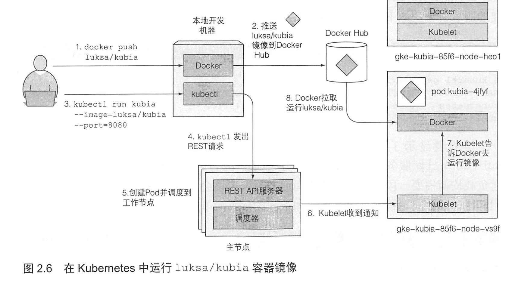

# 开始使用

1. 列出集群节点

   ```bash
   kubectl get nodes
   ```

2. 节点的详细信息

   ```bash
   kubectl describe [node <NODE-NAME>]
   ```

3. 配置 Tab 补全

   ```bash
   source <(kubectl completion bash)
   ```

4. 运行应用

   ```bash
   kubectl run kubia --image=luksa/kubia --port=8080 --generator=run/vl replicationcontroller
   ```

5. 列出 pod

   ```bash
   kubectl get pods
   ```

6. pod 详细信息

   ```bash
   kubectl describe pod [POD-NAME]
   ```

7. 

8. 常规服务（ Cluster IP 服务）， 比如pod ，它也只能从集群内部访问。通过创建LoadBalancer 类型的服务，创建一个外部的负载均衡，可以通过负载均衡的公共 IP 访问 pod 。

9. 创建服务对象，对外暴露服务

   ```bash
   kubectl expose rc kubia --type=LoadBalancer --name kubia-http
   ```

10. 列出服务

    ```bash
    kubectl get servcies
    ```

11. 服务（service）：一组或多组提供相同服务的pod 的静态地址。到达服务 IP 和端口的请求将被转发到属于该服务的一个容器的 IP 和端口。

12. 扩容

    ```bash
    kubectl scale rc <NAME> --replicas=3
    ```
