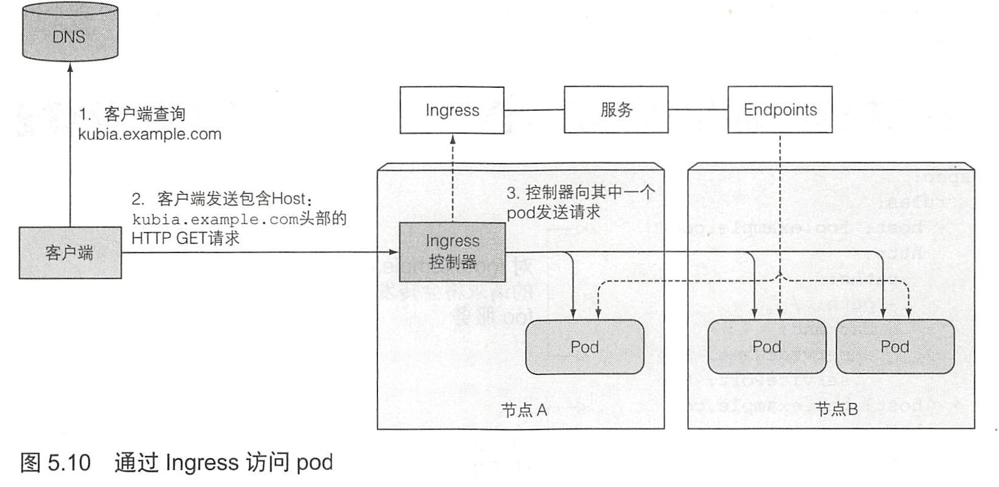

1. 创建服务（service）

   ```bash 
   kubectl expose rc <RC-Name> --port=<Port> --target-port=<T-Port>
   kubectl expose -f <Yaml> --port=<Port> --target-port=<T-Port>
   ```

2. 通过 Yaml 文件

   ```yaml
   spec: 
     ports: 
     	- port: 80
     	  targetPort: 8080
     selector: 
     	app: kubia
   ```

3. 查看服务

   ```bash
   kubectl get svc
   ```

4. 执行命令

   ```bash
   kubectl exec <Pod_Name> -- <CMD>
   ```

   **双横杠(--)代表着 kubectl 命令项的结束。在两个横杠之后的内容是指在 pod 内部需要执行的命令。如果需要执行的命令并没有以横杠开始的参数，横杠也不是必需的。**

5. **特定客户端产生的所有请求每次都指向同一个pod, 可以设置服务的 sessionAffinity 属性为ClientIP。**

6. 在 pod 开始运行的时候， Kubemetes 会初始化一系列的环境变量指向现在存在的服务。如果你创建的服务早于客户端 pod 的创建， pod 上的进程可以根据环境变量获得服务的 IP 地址和端口号。

7. Endpoint 资源就是暴露一个服务的 IP 地址和端口的列表。

8. 外部访问服务：

   1. 将服务的类型设置成 NodePort，每个集群节点都会在节点上打开一个端口， 对于 NodePort 服务， 每个集群节点在节点本身（因此得名叫 NodePort )上打开一个端口，并将在该端口上接收到的流量重定向到基础服务。该服务仅在内部集群IP 和端口上才可访间， 但也可通过所有节点上的专用端口访问。
   2. 将服务的类型设置成 LoadBalance,  NodePort 类型的一种扩展--这使得服务可以通过一个专用的负载均衡器来访问， 这是由 Kubernetes 中正在运行的云基础设施提供的。负载均衡器将流量重定向到跨所有节点的节点端口。客户端通过负载均衡器的IP 连接到服务。
   3. 创建一个 Ingress 资源， 这是一个完全不同的机制， 通过一个 IP 地址公开多个服务--它运行在 HTTP 层（网络协议第7 层）上， 因此可以提供比工作在第4层的服务更多的功能。
   
9. 完全限定域名(FQDN)：格式为someapi.somecompany.com

10. Ingress 在网络栈(HTTP) 的应用层操作， 并且提供基于 cookie 的会话亲和性(session affinity) 等功能。

11. 

12. 就绪探针：就绪探测器会定期调用，并确定特定的 pod 是否接收客户端请求。

13. 就绪探针有三种类型：

    - Exec 探针，执行进程的地方。容器的状态由进程的退出状态代码确定。
    - HTTP GET 探针，向容器发送 HTTP GET 请求，通过响应的 HTTP 状态代码判断容器是否准备好。
    - TCP socket 探针，它打开一个 TCP 连接到容器的指定端口。如果连接己建立，则认为容器己准备就绪。

14. 与存活探针不同，如果容器未通过准备检查，则不会被终止或重新启动。

15. 如果无法通过服务（service）访问 pod, 应该根据下面的列表进行排查：

    1. 首先， 确保从集群内连接到服务的集群 IP, 而不是从外部。
    2. 不要通过 ping 服务 IP 来判断服务是否可访问（请记住， 服务的集群 IP 是虚拟 IP, 是无法 ping 通的）。
    3. 如果已经定义了就绪探针， 请确保它返回成功；否则该 pod 不会成为服务的一部分。
    4. 要确认某个容器是服务的一部分， 请使用 kubectl get endpoints 来检查相应的端点对象。
    5. 如果尝试通过 FQDN 或其中一部分来访问服务（例如， myservice.mynamespace.svc.cluster.local 或myservice.mynamespace), 但并不起作用， 请查看是否可以使用其集群 IP 而不是 FQDN 来访问服务。
    6. 检查是否连接到服务公开的端口， 而不是目标端口。
    7. 尝试直接连接到 pod IP 以确认 pod 正在接收正确端口上的连接。
    8. 如果甚至无法通过 pod 的 IP 访问应用， 请确保应用不是仅绑定到本地主机。

16. 小结

    - 在一个固定的 IP 地址和端口下暴露匹配到某个标签选择器的多个 pod
    - 服务在集群内默认是可访问的， 通过将服务的类型设置为 NodePort 或 LoadBalancer, 使得服务也可以从集群外部访问
    - 让 pod 能够通过查找环境变量发现服务的 IP 地址和端口
    - 允许通过创建服务资源而不指定选择器来发现驻留在集群外部的服务并与之通信， 方法是创建关联的Endpoint资源
    - 为具有 ExternalName 服务类型的外部服务提供 DNS CNAME 别名
    - 通过单个 Ingress 公开多个 HTTP 服务（使用单个IP)
    - 使用 pod 容器的就绪探针来确定是否应该将 pod 包含在服务 endpoints 内
    - 通过创建 headless 服务让 DNS 发现 pod IP
    - 通过 kubectl exec在 pod 容器中执行命令
    - 在现有容器的容器中运行一个 bash shell
    - 通过 kubectl apply 命令修改 Kubemetes 资源
    - 使用 kubectl run --generator= run-pod/v1 运行临时的 pod