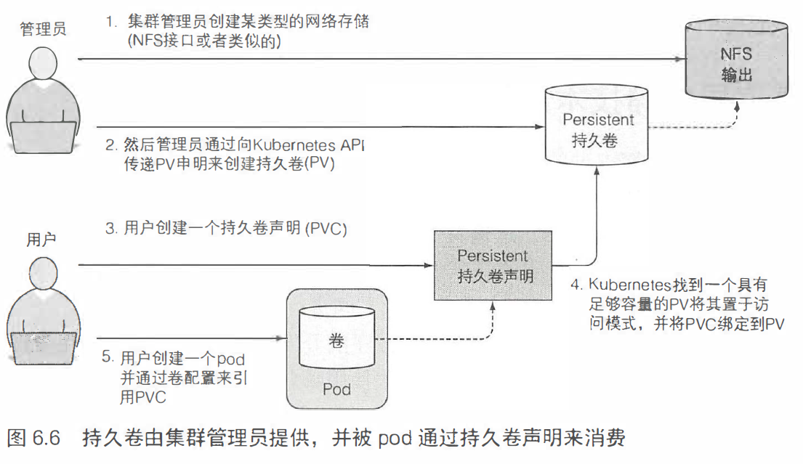
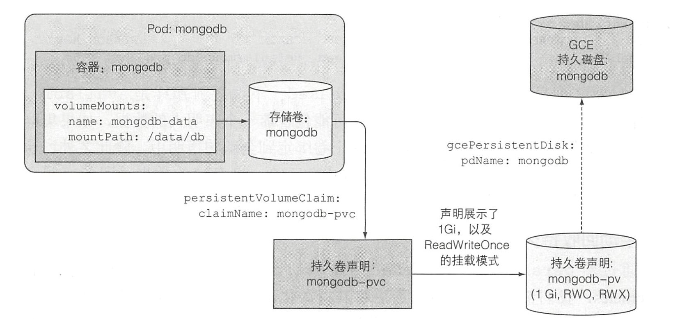
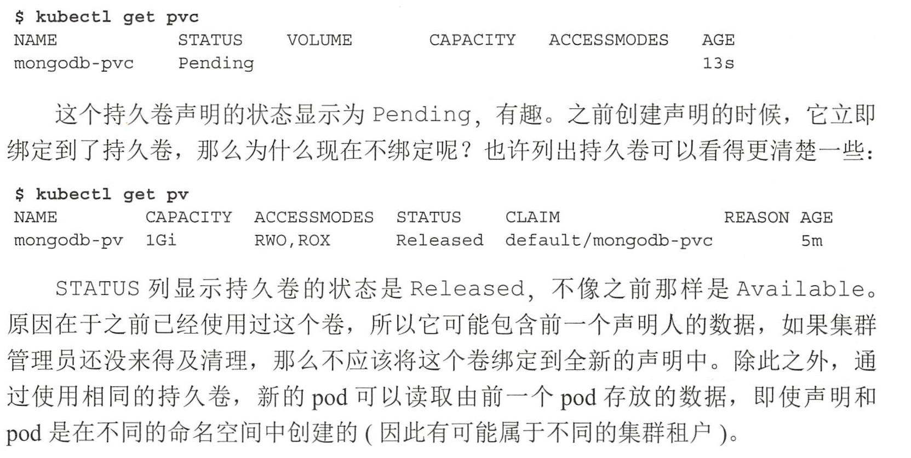
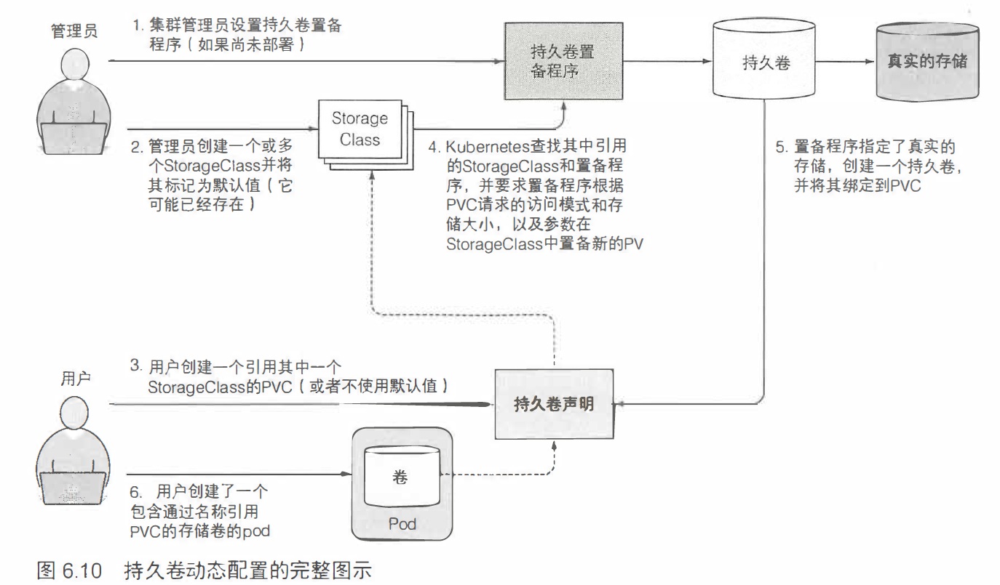

在容器重新启动期间， 卷的内容将保持不变; 在重新启动容器之后， 新容器可以识别前一个容器写入卷的所有文件。另外，如果一个 pod 包含多个容器， 那这个卷可以同时被所有的容器使用。

1. 可用卷类型：

   1. emptyDir -- 用于存储临时数据的简单空目录。
   2. hostPath -- 用于将目录从工作节点的文件系统挂载到 pod。
   3. gitRepo -- 通过检出 Git 仓库的内容来初始化的卷。
   4. nfs -- 挂载到 pod 中的 NFS 共享卷。
   5. cinder 、cephfs、iscsi 、flocker 、glusterfs 、quobyte 、rbd 、flexVolume 、vsphere - Volume 、photoPersistentDis k 、scaleIO 用于挂载其他类型的网络存储。
   6. configMap 、secret 、downwardAPI  -- 用于将 Kubemetes 部分资源和集群信息公开给 pod 的特殊类型的卷。
   7. persistentVolumeClaim -- 一种使用预置或者动态配置的持久存储类型。

2. 研发人员无须向他们的 pod 中添加特定技术的卷， 而是由集群管理员设置底层存储， 然后通过 Kubernetes API 服务器创建持久卷并注册。在创建持久卷时， 管理员可以指定其大小和所支持的访问模式。

3. 当集群用户需要在其 pod 中使用持久化存储时， 他们首先创建持久卷声明(Persistent VolumeClaim, 简称PVC) 清单， 指定所需要的最低容量要求和访问模式，然后用户将待久卷声明清单提交给 Kubernetes API 服务器， Kubernetes 将找到可匹配的待久卷并将其绑定到持久卷声明。

4. 

5. 持久卷**不属于任何命名空间**, 它跟节点一样是集群层面的资源。

6. 访问模式的简写：

   - RWO -- ReadWriteOnce 仅允许单个节点挂载读写。
   - ROX -- ReadOnlyMany 允许多个节点挂载只读。
   - RWX – ReadWriteMany 允许多个节点挂载读写这个卷。

7. 

8. 删除 pod 和持久卷

   ```bash
   # 先删除pod
   kubectl delete pod <pod-name>
   # 再删除持久卷声明
   kubectl delete pvc <pvc-name>
   ```

9. 

10. 持久卷回收策略：Retain、Recycle、Delete。

11. 集群管理员可以创建一个持久卷配置，并定义一个或多个 storageClass 对象，从而让用户选择他们想要的持久卷类型而不仅仅只是创建持久卷。用户可以在其持久卷声明中引用 StoragClass ，而配置程序在配置持久存储时将采用这一点。

12. 与持久卷类似， StorageClass 资源并非命名空间。

13. StorageClasses 的好处在于，声明是通过名称引用它们的。因此，只要 StorageClass 名称在所有这些名称中相同， PVC 定义便可跨不同集群移植。

14. 

15. 小结

    - 使用卷来为 pod 的容器提供临时或持久存储。
    - 创建一个多容器 pod, 并通过为 pod 添加一个卷并将其挂载到每个容器中，来让 pod 中的容器操作相同的文件。
    - 使用 emptyDir 卷存储临时的非持久数据。
    - 使用 giRepo 卷可以在 pod 启动时使用 Git 库的内容轻松填充目录。
    - 使用 hostPath 卷从主机节点访问文件。
    - 将外部存储装载到卷中， 以便在 pod 重启之前保持 pod 数据读写。
    - 通过使用持久卷和持久卷声明解耦 pod 与存储基础架构。
    - 为每个持久卷声明动态设置所需（或缺省）存储类的持久卷。
    - 当需要将持久卷声明绑定到预配置的持久卷时， 防止动态置备程序干扰。


> [Kubernetes中PV/PVC/StorageClass](https://blog.csdn.net/jettery/article/details/72722324)