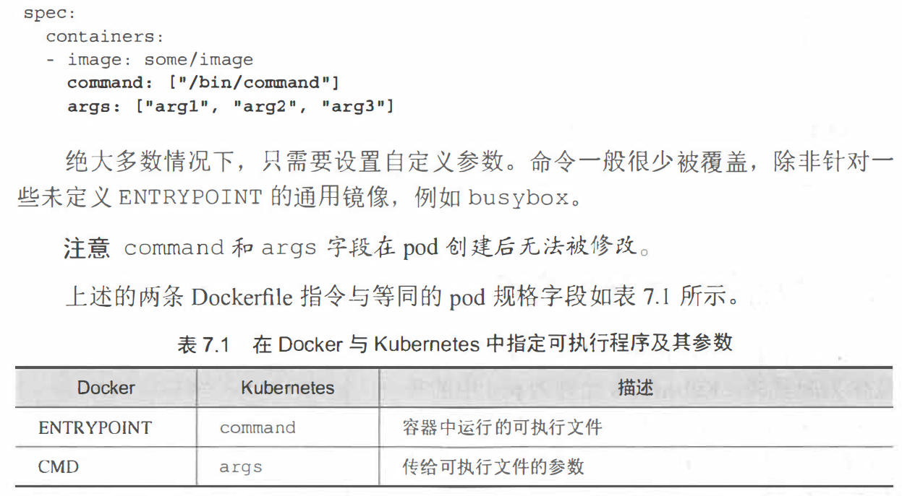
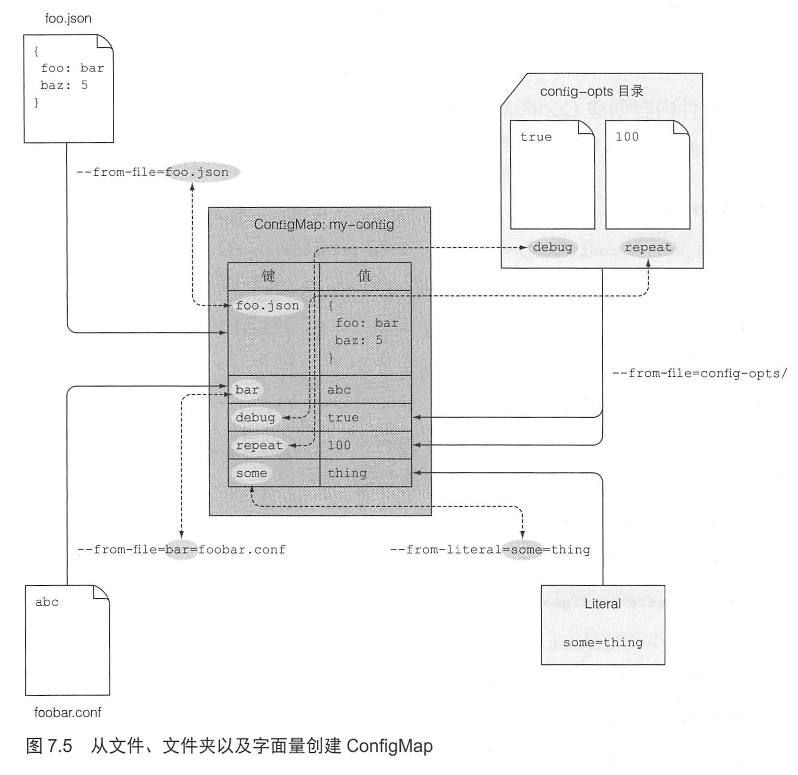

1. ConfigMap：将配置数据置于 Kubernetes 的顶级资源对象中，并可与其他资源定义存入同一 Git 仓库或者基于文件的存储系统中。

2. 配置应用程序：

   - 向容器传递**命令行参数**
   - 为每个容器设置自定义**环境变量**
   - 通过特殊类型的卷将配置文件挂载到容器中

3. 

4. 在每个容器中，Kubemetes 会自动暴露相同命名空间下每个 service 对应的环境变量。这些环境变量基本上可以被看作自动注入的配置。

5. 创建configMap

   ```bash
   kubectl create configmap <configmap-name> --from-literal=[key]=[value] --from-literal=[key]=[value] --from-literal=[key]=[value] 
   kubectl create configmap <configmap-name> --from-file=[/path/file-name]
   ```

6. 

7. 一次性传递 ConfigMap 的所有条目：envFrom

8. Secret 只会存储在节点的内存中， 永不写入物理存储

9. 采用ConfigMap 存储非敏感的文本配置数据。采用 Secret 存储天生敏感的数据， 通过键来引用。如果一个配置文件同时包含敏感与非敏感数据， 该文件应该被存储在 Secret 中。

10. 小结

    - 在 pod 定义中覆盖容器镜像定义的默认命令
    - 传递命令行参数给容器主进程
    - 为容器设置环境变量
    - 将配置从 pod 定义中分离并放入ConfigMap
    - 通过 Secret 存储敏感数据并安全分发至容器
    - 创建 docker-registry Secret 用以从私有镜像仓库拉取镜像