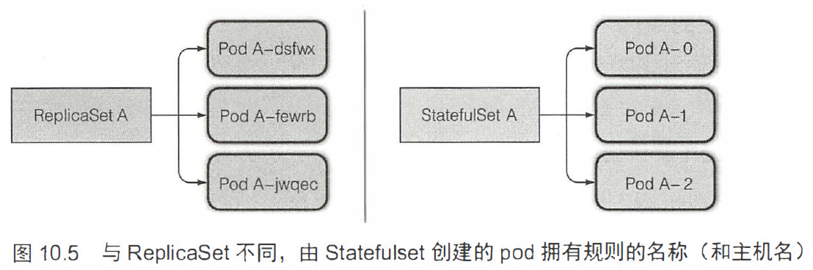
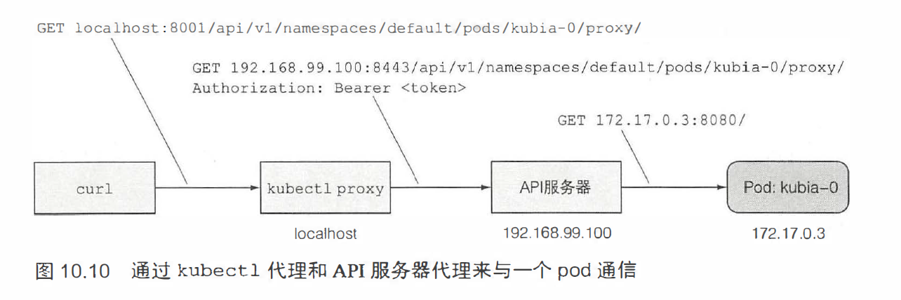

# StatefulSet

1. 每个实例有单独存储的多副本

   - 手动控制 Pod

     需要手动管理，当有节点故障，需要手动创建

   - 一个 ReplicaSet 对应一个 Pod，创建多个RS

     不方便，不能弹性伸缩

   - 每个 Pod 使用同一数据卷中的不同目录

     实例间相互合作，正确性很难保证，同时共享存储会成为整个应用的性能瓶颈

2. StatefulSet：每一个实例都是不可替代的个体， 都拥有稳定的名字和状态。

3. Statefulset 保证了 pod 在重新调度后保留它们的标识和状态（名称和主机名）。每个 pod 都可以拥有一组独立的数据卷（持久化状态）

4. 一个 Statefulset 创建的每个 pod 都有一个从零开始的顺序索引

   

5. 缩容一个 Statefulset 将会最先删除最高索引值的实例，如图 10.5 中的 Pod A-2

6. Statefulset 在有实例不健康的情况下是不允许做缩容操作的。若一个实例是不健康的，而这时再缩容一个实例的话，也就意味着你实际上同时失去了两个集群成员。

7. Statefulset 缩容时不删除持久卷声明，扩容时会重新挂载上

8. 

9. SRV 记录用来指向提供指定服务的服务器的主机名和端口号。

10. 控制台没收到节点发送的状态更新，该节点上面的所有 pod 状态都会变为 Unknow 。

11. 强制删除 Pod

    ```bash
    kubectl delete <Pod-name> -- force --grace - period 0
    ```

12. 小结（Statefulset）

    - 给副本 pod 配置单独的存储
    - 给一个 pod 提供稳定的标识
    - 扩缩容、更新一个 Statefulset
    - 通过 DNS 发现 Statefulset 的其他成员
    - 通过其他成员的主机名与之建立连接
    - 强制删除有状态 pod
