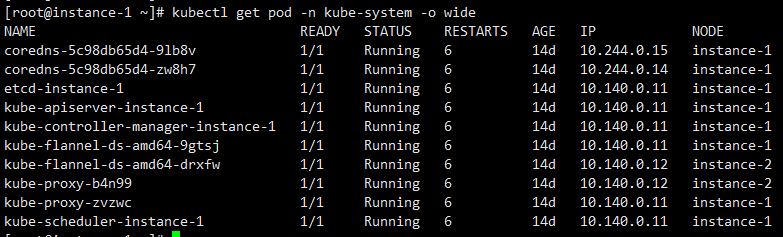
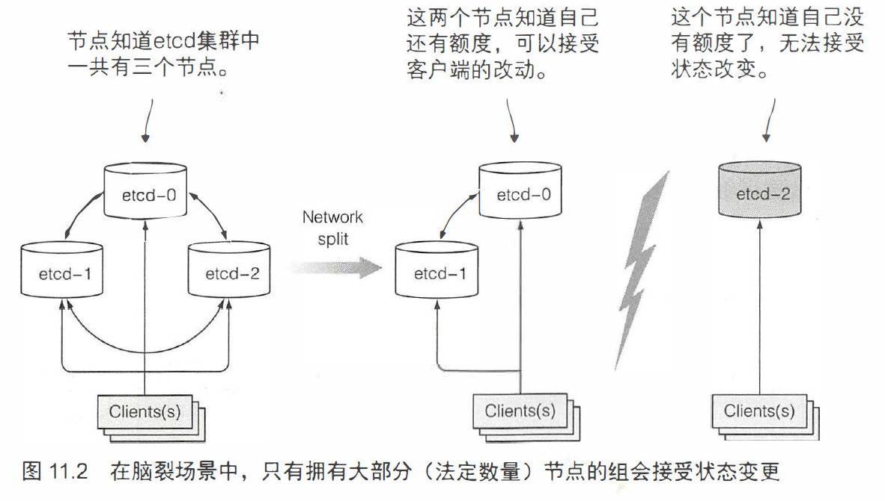
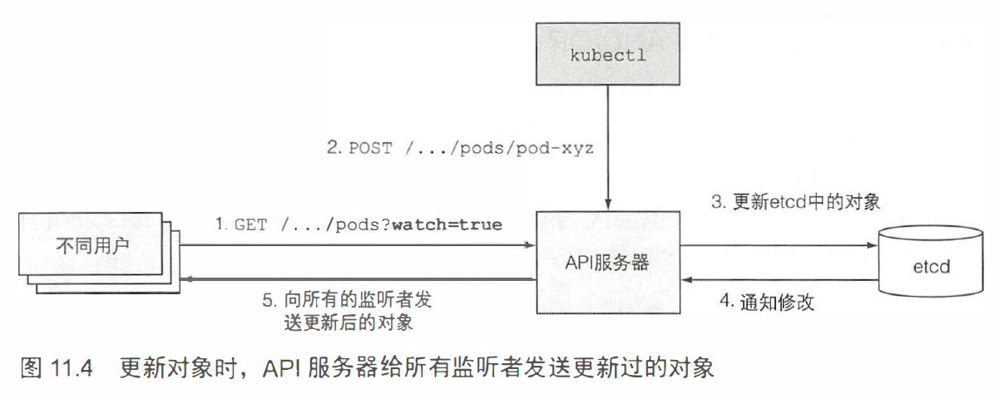

1. 控制平面负责控制并使得整个集群正常运行。

   - Etcd 分布式持久化存储
   - API 服务器
   - 调度器
   - 控制器管理器

2. 工作节点负责容器的运行任务

   - kubelet
   - kube-proxy
   - 容器运行时（Docker、rkt 等）

3. 附加组件

   - DNS 服务器
   - 仪表盘
   - Ingress 控制器
   - Heapster（容器集群监控）
   - 容器网络接口插件

4. 

5. ComponentStatus 是一个 API 资源， 用来显示每个控制平面组件的健康状态。

   ```bash
   kubectl get componentstatuses
   ```

6. Kubemetes 系统组件间只能通过 API 服务器通信， 它们之间不会直接通信。

7. API 服务器是和 etcd 通信的**唯一组件**。其他组件不会直接和 etcd 通信， 而是通过 API 服务器来修改集群状态。

8. `kubectl attach` 命令和 `kubectl exec` 命令类似， 区别是：前者会附属到容器中运行着的主进程上， 而后者是重新运行一个进程。

9. Kubelet 是唯一一直作为常规系统组件来运行的组件，它把其他组件作为 pod 来运行

   

10. etcd 是一个响应快、分布式、一致的 key-value 存储。etcd 是 Kubemetes 存储集群状态和元数据的唯一的
      地方。

   优点：增强乐观锁系统、验证系统的健壮性；并且，通过把实际存储机制从其他组件抽离，未来替换起来也更容易

   > 乐观并发控制是指一段数据包含一个版本数宇，而不锁住该段数据并阻止读写操作。每当更新数据，版本数就会增加。当更新数据时，就会检查版本值是否在客户端读取数据时间和提交时间之间被增加过。如果增加过，那么更新会被拒绝，客户端必须重新读取新数据，重新尝试更新。
   >
   > 两个客户端尝试更新同一个数据条目，只有笫一个会成功。
   >
   > 所有的 Kubernetes 包含一个 metadata.resourceVersion 宇段，当更新对象时，客户端需要返回该值到API 服务器。如果版本值与 etcd 中存储的不匹配，API 服务器会拒绝该更新。

   ```bash
   # 列出 Default 命名空间中 Pod 的 Etcd 条目
   etcdctl ls /registry/pods/default
   # 显示 Pod 的 Json 定义
   etcdctl get /registry/pods/default/kubia...
   ```

11. 

12. etcd 实例数量**应该是奇数**

13. Kubenetes  API 服务器作为中心组件， 其他组件或者客户端（如 kubectl )都会去调用它。以 RESTful-API 的形式提供了可以查询、修改集群状态的 CRUD (Create、Read、Update、Delete) 接口

14. 

15. 认证、授权、准入

    1. API 服务器需要认证发送请求的客户端。这是通过配置在 API 服务器上的一个或多个认证插件来实现的。API 服务器会轮流调用这些插件， 直到有一个能确认是谁发送了该请求。这是通过检查HTTP请求实现的。
    2. 授权插件决定认证的用户是否可以对请求资源执行请求操作。
    3. 如果请求尝试创建、修改或者删除一个资源， 请求需要经过准入控制插件的验证。
       - AlwaysPullImages -- 重写 pod 的 imagePullPolicy 为 Always, 强制每次部署 pod 时拉取镜像。
       - ServiceAccount -- 未明确定义服务账户的使用默认账户。
       - NamespaceLifecycle -- 防止在命名空间中创建正在被删除的 pod, 或在不存在的命名空间中创建pod。
       - ResourceQuota -- 保证特定命名空间中的 pod 只能使用该命名空间分配数量的资源， 如 CPU 和内存。
    
16. 

17. 调度器：利用 API 服务器的监听机制等待新创建的 pod, 然后给每个新的、没有节点集的 pod 分配节点。

18. 调度器**不会命令**选中的节点（或者节点上运行的 Kubelet) 去运行 pod。调度器就是通过 API 服务器更新 pod 的定义，然后 API 服务器再去通知 Kubelet，该 pod 已经被调度过。当目标节点上的 Kubelet 发现该 pod 被调度到本节点， 它就会创建并且运行 pod 的容器。

19. 控制器：确保系统真实状态向 API 服务器定义的期望状态收敛。控制器执行一个“调和“ 循环， 将实际状态调整为期望状态（在资源 spec 部分定义）， 然后将新的实际状态写入资源的 status 部分。

20. 单个控制器、管理器进程组成了多个执行不同非冲突任务的控制器

    - Replication 管理器(ReplicationController 资源的管理器）
    - ReplicaSet、DaemonSet 以及 Job 控制器
    - Deployment 控制器
    - StatefulSet 控制器
    - Node 控制器
    - Service 控制器
    - Endpoints 控制器
    - Namespace 控制器
    - PersistentVolume 控制器
    - 其他
    
21. 所有控制器是通过 API 服务器来操作 API 对象的。它们不会直接和 Kubelet 通信或者发送任何类型的指令。

22. Kubelet 就是负责所有运行在工作节点上内容的组件。它第一个任务就是在 API 服务器中创建一个 Node 资源来注册该节点。然后需要持续监控 API 服务器是否把该节点分配 pod ， 然后启动 pod 容器。Kubelet 随后持续监控运行的容器，向 API 服务器报告它们的状态、事件和资源消耗。Kubelet 也是运行容器存活探针的组件，当探针报错时它会重启容器。最后一点，当 pod 从 API 服务器删除时， Kubelet 终止容器，并通知服务器 pod 己经被终止了。

23. kube-proxy ， 用于确保客户端可以通过 Kubemetes API 连接到你定义的服务。kube-proxy 确保对服务 IP 和端口的连接最终能到达支持服务的某个 pod 处。如果有多个 pod 支撑一个服务，那么代理会发挥对 pod 的负载均衡作用。

24. kube-dns pod 利用 API 服务器的监控机制来订阅 Service 和 Endpoint 的变动，以及 DNS 记录的变更，使得其客户端总是能够获取到最新的 DNS 信息。

25. Ingress 控制器运行一个反向代理服务器（例如，类似 Nginx), 根据集群中定义的 Ingress、Service 以及Endpoint 资源来配置该控制器。所以需要订阅这些资源（通过监听机制）， 然后每次其中一个发生变化则更新代理服务器的配置。

26. 

    8 -- 节点上的 Kubelet 通过 API 器监听 pod 变更， 发现有新的 pod 分配到本节点后， 会去检查 pod 定义，然后命令 Docker 或者任何使用的容器运行时来启动 pod 容器，容器运行时就会去运行容器。

27. 运行一个单容器的 Pod，会在运行此容器前运行一个被暂停的附加容器，此容器作用是保存所有的命名空间。当容器重启， 容器可以处在与之前相同的 Linux 命名空间中。

28. pod 用于通信的网络必须是：pod 自己认为的 IP 地址一定和所有其他节点认为该 pod 拥有的 IP 地址一致。

29. kube-schedule 包含了 holderidentity 宇段（当前领导者的名字），乐观并发保证如果有多个实例尝试写名
    字到资源，只有一个会成功。根据是否写成功，每个实例就知道自己是否是领导者。

30. 一旦成为领导者，必须顶起更新资源（默认每 2 秒），这样所有其他的实例就知道它是否还存活。当领导者若机，其他实例会发现资源有一阵没被更新了，就会尝试将自己的名字写到资源中尝试成为领导者。

