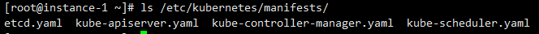
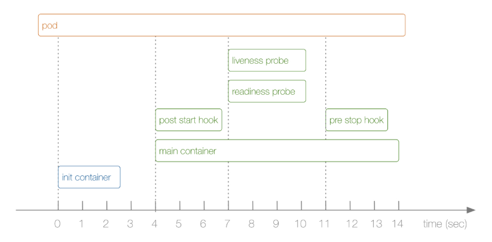

[TOC]

## ReplicationController 和 Pod

> ReplicationController 确保在任何时间上运行 pod 的 Replicas 数为定义的数量。
>
> 换句话说，一个 ReplicationController 确保 pod 总是运行和可用的。

第一，RC 可以确保 Pod 在运行，例如使用 `kubectl delete pod <pod-name>` 删除 pod，如果使用 RC 控制器管理的 Pod， 则 RC 会重新起一个 Pod，以达到定义中期待的数目（Replica）。

第二，如果一个节点（Node）出现问题，RC 也会将 Pod 调度到另一个可用节点。

第三，确保 Pod 健康，如果 Pod 无法提供正常服务时，RC 也会杀死不健康的 Pod，重新创建。

第四，滚动升级。RC 使用 `kubectl rolling-update` 滚动升级。

```bash
kubectl rolling-update <rc-name> <option>
# 如果在更新期间取消更新，通过`--rollback`回滚
kubectl rolling-update <rc-name> --rollback
```

## ReplicationController 和 ReplicaSet[^1]

> [`ReplicaSet`](https://k8smeetup.github.io/docs/concepts/workloads/controllers/replicaset/) 是下一代 ReplicationController ，支持新的 [set-based label selector](https://k8smeetup.github.io/docs/user-guide/labels/#set-based-requirement)。

ReplicationController 标签选择器（lable selector）只支持 “基于等式”，即 `environment = production,
tier != frontend` 

ReplicaSet 标签选择器支持 “基于集合”，即

```yaml
environment in (production, qa)
tier notin (frontend, backend)
partition
!partition
```

## Kubernetes 核心组件

1. etcd：保存了集群的所有信息，使用 json 格式储存，只有 ApiServer 可以与它通信，查询或修改值。
2. apiserver：提供 HTTP REST API 接口（资源操作）、认证、授权、访问控制、API 注册和发现等功能。其他组件都通过其进行通信。
3. controller manager（控制器）：维护集群的状态，~~如故障检测，pod 扩展，滚动更新等~~，有很多种类型控制器。控制系统向定义的状态变化，如达到特定的 `replica`。
4. scheduler（调度器）：资源的调度，按调度的策略将 Pod 调度到节点上。
5. kubelet：第一：向 API Server 注册节点。第二：向 API Server 报告 Pod 状态、资源信息。第三：处理 API Server 下发的任务（Pod 运行等）。
6. kube-proxy：提供服务发现和负载均衡。映射 service 和 endpoint，将请求按照算法转发到 pod 上。

## 创建 Pod 流程

``` sequence
title: 创建 pod 流程
participant kubectl
participant apiserver
participant etcd
participant scheduler
participant kubelet
participant docker

kubectl->apiserver: create pod
apiserver-->kubectl:
apiserver->etcd: write
etcd-->apiserver:
apiserver->scheduler: watch(new pod)
scheduler->apiserver: bind pod
apiserver->etcd: write
etcd-->apiserver:
apiserver->kubelet: watch(bound pod)
kubelet->docker: docker run
docker-->kubelet:
kubelet->apiserver: udpate pod status
apiserver->etcd: write
etcd-->apiserver:
apiserver-->kubelet:
```

## RBAC 授权[^2]

### Role 和 ClusterRole

角色（Role）和集群角色（ClusterRole）：可以在规则内（Rule）中授权操作（Verb）各种资源（Resource）。比如读取、检查 Pod 的权限。

```yaml
...
rules: 
  # "" 代表核心 API 组
  - apiGroups: [""]
  	resources: ["pod"]
  	verbs: ["get", "list", "watch"]
```

Role 是定义在命名空间（Namespace）内，而 ClusterRole 是定义在集群范围内（Cluster）。因此 **Role 只能在特定的命名空间内访问**，而 **ClusterRole 可以访问一些集群特定的内容**，比如集群内的资源（比如 Node），非资源端点（no-resource endpoints，比如 /healthz），所有命名空间内的资源。

### RoleBinding 和 ClusterRoleBinding

一个或一组用户（Subject：User，Group，Service Account）通过和 Role 或 ClusterRole 绑定，获取相应的权限。

角色绑定（RoleBinding）：只能绑定同一个命名空间内的 Role。

集群角色绑定（ClusterRoleBinding）：绑定后，权限范围为整个集群。

### Resource

主要的资源：Pod，Node，Service，Deployment，Replicaset，Statefulset，Namespace，Secret，ConfigMap。

部分资源存在子资源，如 Pod 的子资源就有 Log。

```bash
GET /api/v1/namespaces/{namespace}/pods/{name}/log
```

### Subject

包括用户（User），组（Group），服务账号（Service Account）。

`system：…` ：为 Kubernetes 系统使用。

```yaml
...
subjects:
- kind:User
  name:"alice@example.com"
  apiGroup:rbac.authorization.k8s.io
  
---
...
subjects:
- kind:ServiceAccount
  name:default
  namespace:kube-system
# 注意 apiGroup 和 namespace
```

```bash
# 所有服务账户
system:serviceaccounts
# test 命名空间内的所有服务账户
system:serviceaccounts:test
# 所有认证的用户
system:autherticated
# 所有未认证的用户
system:unauthenticated
```

## 静态 Pod

> 静态 Pod 直接由特定节点上的`kubelet`进程来管理，不通过 master 节点上的 `apiserver`。无法与我们常用的控制器`Deployment`或者`DaemonSet`进行关联，它由`kubelet`进程自己来监控，当`pod`崩溃时重启该`pod`，`kubelete`也无法对他们进行健康检查。
>
> 静态 pod 始终绑定在某一个`kubelet`，并且始终运行在同一个节点上。 `kubelet`会自动为每一个静态 pod 在 Kubernetes 的 apiserver 上创建一个镜像 Pod（Mirror Pod），因此我们可以在 apiserver 中查询到该 pod，但是不能通过 apiserver 进行控制（例如不能删除）。

通过配置文件：`--pod-manifest-path=/etc/kubernetes/manifests`

通过 HTTP 方式：`-–manifest-url=`

kubelet 会周期性的扫描目录或者 URL，当文件创建或消失后创建或删除 Pod。

几个重要的静态 Pod：

## Pod Hook（生命周期钩子）

Pod Hook 由 Kubelet 发起，在容器启动前或者进程终止前运行。

- PostStart：这个钩子在容器创建后立即执行。但是，并不能保证钩子将在容器`ENTRYPOINT`之前运行，因为没有参数传递给处理程序。主要用于资源部署、环境准备等。不过需要注意的是如果钩子花费太长时间以至于不能运行或者挂起， 容器将不能达到`running`状态。
- PreStop：这个钩子在容器终止之前立即被调用。它是阻塞的，意味着它是同步的， 所以它必须在删除容器的调用发出之前完成。主要用于优雅关闭应用程序、通知其他系统等。如果钩子在执行期间挂起， Pod 阶段将停留在`running`状态并且永不会达到`failed`状态。

两种方式来实现上面的钩子函数：

- Exec - 用于执行一段特定的命令，**该命令消耗的资源会被计入容器**。
- HTTP - 对容器上的特定的端点执行`HTTP`请求。

强制删除一个 pod 是从集群状态还有 etcd 里**立刻删除**这个 pod。 当 Pod 被强制删除时， api 服务器**不会等待来自 Pod 所在节点上的 kubelet 的确认信息**。在节点上， pod 被设置成立刻终止后，在**强行杀掉前还会有一个很小的宽限期**。

```yaml
apiVersion: v1
kind: Pod
metadata:
name: hook-demo
spec:
containers:
 - name: hook-demo
 image: nginx
 lifecycle:
   preStop:
     exec:
       # 在强制删除 Pod 时，优雅的退出 Nginx
       command: ["/usr/sbin/nginx","-s","quit"]
```

## 健康检查

> 通过 `liveness probe` 来确定应用程序是否正在运行。
>
> 通过 `readiness probe` 来确定容器是否已经就绪，能否接收流量。
>
> 探针的支持配置方式：
>
> 1. exec：执行一段命令
> 2. http：检测某个 http 请求
> 3. tcpSocket：kubelet 将尝试在指定端口上打开容器的套接字。如果可以建立连接，容器被认为是健康的，如果不能就认为是失败的
>
> ```yaml
> # 就绪探针
> readinessProbe:
> tcpSocket:
>   port: 80
> initialDelaySeconds: 5
> periodSeconds: 10
> # 健康探针
> livenessProbe:
> httpGet:
>   path: /
>   port: 80
> # 第一次探测之前等待 15S
> initialDelaySeconds: 15
> # 间隔周期
> periodSeconds: 20
> ```
>
> 1. timeoutSeconds：探测超时时间，默认 1 秒，最小 1 秒。
> 2. successThreshold：探测失败后，最少连续探测成功多少次才被认定为成功。默认是 1，但是如果是`liveness` 则必须是 1，最小值是 1。
> 3. failureThreshold：探测成功后，最少连续探测失败多少次才被认定为失败。默认是 3，最小值是 1。

## Init Container（初始化容器）



> - 解决服务之间的依赖问题。比如我们有一个 Web 服务，该服务又依赖于另外一个数据库服务，但是在我们启动这个 Web 服务的时候我们并不能保证依赖的这个数据库服务就已经启动起来了，所以可能会出现一段时间内 Web 服务连接数据库异常。要解决这个问题的话我们就可以在 Web 服务的 Pod 中使用一个 InitContainer，在这个初始化容器中去检查数据库是否已经准备好了，准备好了过后初始化容器就结束退出，然后我们的主容器 Web 服务被启动起来，这个时候去连接数据库就不会有问题了。
> - 初始化配置。比如集群里检测所有已经存在的成员节点，为主容器准备好集群的配置信息，这样主容器起来后就能用这个配置信息加入集群。
> - 其它场景：如将 pod 注册到一个中央数据库、配置中心等。
>
> ```yaml
> initContainers: 
>   - name: init-myservice
>  image: busybox
>  command:
>     - "sh"
>     - "-c"
>     - "until nslookup myservice; do echo waiting for myservice; sleep 2; done;"
> ---
> # 先 Create 上一部分，查看 Pod 状态
> apiVersion: v1
> kind: Service
> metadata:
> name: myservice
> spec:
> ports:
>   - port: <Port>
>  targetPort: <Port>
> ```

## Deployment 的功能

- RC 或 RS 的所有功能
- 事件和状态查看：可以查看`Deployment`的升级详细进度和状态
- 回滚：当升级`Pod`的时候如果出现问题，可以使用回滚操作回滚到之前的任一版本
- 版本记录：每一次对`Deployment`的操作，都能够保存下来，这也是保证可以回滚到任一版本的基础
- 暂停和启动：对于每一次升级都能够随时暂停和启动

## Deploy 部署技巧

1. 部署/更新 deployment 时带上 `record` 指令

   ```bash
   kubectl create/apply -f <name.yml> --record
   ```

2. 通过 `spec.revisionHistoryLimit` 限制 `revision number` 

3. 手动删除 `ReplicaSet` ，`Rolling history` 也会被删除

4. 通过 `revision` 参看 Pod 的定义

   ```bash 
   kubectl rollout deploy/<name> --revision=<number>
   ```

5. 通过 `revision` 回滚

   ```bash
   kubectl rollout undo deploy/<name> --to-revision=<number>
   ```

## Job 和 CronJob

> `Job`负责处理任务，即仅执行一次的任务，它保证批处理任务的一个或多个`Pod`成功结束。
>
> `CronJob`就是在`Job`上加上了时间调度。

在定义 Job 时，必须在 yaml 中添加 `spec.template.spec.restartPolicy`

```yaml
restartPolicy: OnFailure
# 或
restartPolicy: Never
```

## Service

### 三种 IP 类型

> - Node IP：`Node`节点的 IP 地址
> - Pod IP： `Pod`的 IP 地址
> - Cluster IP：`Service`的 IP 地址

### Service 类型

> - ClusterIP：通过集群的内部 IP 暴露服务，服务只能够在集群内部可以访问，这也是默认的ServiceType。
> - NodePort：通过每个 Node 节点上的 IP 和静态端口（NodePort）暴露服务。NodePort 服务会路由到 ClusterIP 服务，这个 ClusterIP 服务会自动创建。通过请求 ，可以从集群的外部访问一个 NodePort 服务。
> - LoadBalancer：使用云提供商的负载局衡器，可以向外部暴露服务。外部的负载均衡器可以路由到 NodePort 服务和 ClusterIP 服务，这个需要结合具体的云厂商进行操作。
> - ExternalName：通过返回 CNAME 和它的值，可以将服务映射到 externalName 字段的内容（例如， foo.bar.example.com）。

## ConfigMap 使用

### 创建 ConfigMap

1. 通过目录（目录中包含文件 [k-v]）

   ```bash
   kubectl create configmap <name> --from-file=<Path>
   ```

2. 通过文件

   ```bash
   kubectl create configmap <name> --from-file=<File>
   ```

3. 通过命令行定义

   ```bash
   kubectl create configmap <name> --from-literal=<Key>=<Value> --from-literal=<Key>=<Value>
   ```

### 使用 ConfigMap

> 1. 设置环境变量的值
>
>    在 `.spec.containers.env` 或 `.spec.containers.envFrom` 中定义
>
> 2. 在容器里设置命令行参数
>
>    `$(KEY)`
>
> 3. 在数据卷里面创建 config 文件
>
>    在数据卷里面使用 `ConfigMap`，就是将文件填入数据卷，在这个文件中，**键就是文件名，键值就是文件内容**

## Secret 的使用

### 类型

> - Opaque：base64 编码格式的 Secret，用来存储密码、密钥等；但数据也可以通过base64 –decode解码得到原始数据，所有加密性很弱。
> - kubernetes.io/dockerconfigjson：用来存储私有docker registry的认证信息。
> - kubernetes.io/service-account-token：用于被 `serviceaccount` 引用，serviceaccout 创建时Kubernetes会默认创建对应的secret。Pod如果使用了serviceaccount，对应的secret会自动挂载到Pod目录`/run/secrets/kubernetes.io/serviceaccount`中。

### 使用 Secret

> - 以环境变量的形式
> - 以 Volume 的形式挂载

## ConfigMap 和 Secret 对比

> 相同点：
>
> - key/value 的形式
> - 属于某个特定的 namespace
> - 可以导出到环境变量
> - 可以通过目录/文件形式挂载
> - 通过 volume 挂载的配置信息均可热更新
>
> 不同点：
>
> - Secret 可以被 ServerAccount 关联
> - Secret 可以存储 docker register 的鉴权信息，用在 ImagePullSecret 参数中，用于拉取私有仓库的镜像
> - Secret 支持 Base64 加密
> - Secret 分为 kubernetes.io/service-account-token、kubernetes.io/dockerconfigjson、Opaque 三种类型，而 Configmap 不区分类型

## DaemonSet 的使用

> Daemon，用来部署守护进程。`DaemonSet` 用于在每个 `Kubernetes` 节点中将守护进程的副本作为后台进程运行，当节点加入到 `Kubernetes` 集群中，`Pod` 会被调度到该节点上运行，当节点从集群只能够被移除后，该节点上的这个 `Pod` 也会被移除。如果我们删除 `DaemonSet`，所有和这个对象相关的 `Pods` 都会被删除。
>
> - 集群存储守护程序，如 `glusterd`、`ceph` 要部署在每个节点上以提供持久性存储；
> - 节点监视守护进程，如 `Prometheus` 监控集群，可以在每个节点上运行一个 `node-exporter` 进程来收集监控节点的信息；
> - 日志收集守护程序，如 `fluentd` 或 `logstash`，在每个节点上运行以收集容器的日志。
>
> 其他：
>
> - `DaemonSet`并不关心一个节点的`unshedulable`字段。
> - **`DaemonSet`可以创建`Pod`，即使调度器还没有启动**。

## StatefulSet 的使用

> - 无状态服务（Stateless Service）：该服务运行的实例不会在本地存储需要持久化的数据，并且多个实例对于同一个请求响应的结果是完全一致的，比如前面我们讲解的`WordPress`实例，我们是不是可以同时启动多个实例，但是我们访问任意一个实例得到的结果都是一样的吧？因为他唯一需要持久化的数据是存储在`MySQL`数据库中的，所以我们可以说`WordPress`这个应用是无状态服务，但是`MySQL`数据库就不是了，因为他需要把数据持久化到本地。
> - 有状态服务（Stateful Service）：就和上面的概念是对立的了，该服务运行的实例需要在本地存储持久化数据，比如上面的`MySQL`数据库，你现在运行在节点A，那么他的数据就存储在节点A上面的，如果这个时候你把该服务迁移到节点B去的话，那么就没有之前的数据了，因为他需要去对应的数据目录里面恢复数据，而此时没有任何数据。
>
> 功能：
>
> - 稳定的、唯一的网络标识符
> - 稳定的、持久化的存储
> - 有序的、优雅的部署和缩放

## 持久化存储

> PersistentVolume（持久化卷），是对底层的共享存储的一种抽象，PV 由管理员进行创建和配置，它和具体的底层的共享存储技术的实现方式有关，比如 Ceph、GlusterFS、NFS 等，通过插件机制完成与共享存储的对接。
>
> PersistentVolumeClaim（持久化卷声明），PVC 是用户存储的一种声明。
>
> StorageClass，管理员可以将存储资源定义为某种类型的资源，比如快速存储、慢速存储等，用户根据 StorageClass 的描述就可以非常直观的知道各种存储资源的具体特性，这样就可以根据应用的特性去申请合适的存储资源。

### AccessModes（访问模式）

> - ReadWriteOnce（RWO）：读写权限，但是只能被单个节点挂载
> - ReadOnlyMany（ROX）：只读权限，可以被多个节点挂载
> - ReadWriteMany（RWX）：读写权限，可以被多个节点挂载

### persistentVolumeReclaimPolicy（回收策略）

> - Retain（保留）- 保留数据，需要管理员手工清理数据
> - Recycle（回收）- 清除 PV 中的数据，效果相当于执行 rm -rf /thevolume/*
> - Delete（删除）- 与 PV 相连的后端存储完成 volume 的删除操作，这常见于云服务商的存储服务，比如 ASW EBS。
>
> 注意：目前只有 NFS 和 HostPath 两种类型支持回收策略。

### PV 状态

> - Available（可用）：表示可用状态，还未被任何 PVC 绑定
> - Bound（已绑定）：表示 PVC 已经被 PVC 绑定
> - Released（已释放）：PVC 被删除，但是资源还未被集群重新声明
> - Failed（失败）： 表示该 PV 的自动回收失败

### 注意

1. 使用 `subPath` 在挂载卷中新建文件夹，避免混淆

   ```yaml
   volumeMounts:
     - name: nfs-pv-nginx
     	subPath: nfs-pvc-nginx
       mountPath: /usr/share/nginx/html
   ```

2. 删除 PV（Recycle），先保留 PVC

   > 如有 Pod 正在使用 PVC 的话，那么在新建的 Pod 中仍可使用；
   >
   > 如无 Pod 使用，则新建 Pod 挂载此 PVC 时会出现失败。

3. 再删除 PVC

   > nfs 的共享数据目录下面已经没有数据，因为 PVC 被删除，然后系统回收了数据

### StorageClass

#### nfs-client

> - 自动创建的 PV 以`${namespace}-${pvcName}-${pvName}`这样的命名格式创建在 NFS 服务器上的共享数据目录中
> - 而当这个 PV 被回收后会以`archieved-${namespace}-${pvcName}-${pvName}`这样的命名格式存在 NFS 服务器上

#### 声明使用 StorageClass 

```yaml
metadata:
  name: pvc
  annotations:
    volume.beta.kubernetes.io/storage-class: "course-nfs-storage"
```

#### 通过 `.spec.volumeClaimTemplates` 声明 PVC

```yaml
volumeClaimTemplates:
  - metadata:
      name: <name>
      annotations:
        volume.beta.kubernetes.io/storage-class: course-nfs-storage
	spec:
      accessModes: [ "ReadWriteOnce" ]
      resources:
        requests:
          storage: 1Gi
```

## Ingress

> Ingress controller 可以理解为一个监听器，不断地与 kube-apiserver 打交道，实时的感知后端 service、pod 的变化，当得到这些变化信息后，Ingress controller 再结合 Ingress 的配置，更新反向代理负载均衡器。

[Ingress安装]([https://github.com/opsxin/markdown-notes/blob/master/K8S/Ingress%E5%AE%89%E8%A3%85.md](https://github.com/opsxin/markdown-notes/blob/master/K8S/Ingress安装.md))

------

## Helm 

> 三个重要概念：
>
> - chart：包含了创建 `Kubernetes` 的一个应用实例的必要信息
> - config：包含了应用发布配置信息
> - release：是一个 chart 及其配置的一个运行实例
>
> `Helm Client` 是用户命令行工具，其主要负责如下：
>
> - 本地 chart 开发
> - 仓库管理
> - 与 Tiller sever 交互
> - 发送预安装的 chart
> - 查询 release 信息
> - 要求升级或卸载已存在的 release
>
> `Tiller Server`是一个部署在 `Kubernetes` 集群内部的 server，其与 Helm client、Kubernetes API server 进行交互。Tiller server 主要负责如下：
>
> - 监听来自 Helm client 的请求
> - 通过 chart 及其配置构建一次发布
> - 安装 chart 到 `Kubernetes` 集群，并跟踪随后的发布
> - 通过与 `Kubernetes` 交互升级或卸载 chart
> - 简单的说，client 管理 charts，而 server 管理发布 release

:m: Mark

## Kube-Scheduler

> 根据特定的调度算法和调度策略将 Pod 调度到合适的 Node 节点，启动之后会一直监听 API Server，获取到 PodSpec.NodeName 为空的 Pod，对每个 Pod 创建一个 binding。
>
> 调度主要分为以下几个部分：
>
> - 首先是**预选过程**，过滤掉不满足条件的节点，这个过程称为`Predicates`
> - 然后是**优选过程**，对通过的节点按照优先级排序，称之为`Priorities`
> - 最后从中选择优先级最高的节点，如果中间任何一步骤有错误，就直接返回错误
>
> `Predicates `阶段首先遍历全部节点，过滤掉不满足条件的节点，属于强制性规则，这一阶段输出的所有满足要求的 Node 将被记录并作为第二阶段的输入，如果所有的节点都不满足条件，那么 Pod 将会一直处于 Pending 状态，直到有节点满足条件，在这期间调度器会不断的重试。
>
> `Priorities`阶段即再次对节点进行筛选，如果有多个节点都满足条件的话，那么系统会按照节点的优先级（priorites）大小对节点进行排序，最后选择优先级最高的节点来部署 Pod 应用。

### 调度流程

> - 首先，客户端通过 API Server 的 REST API 或者 kubectl 工具创建 Pod 资源
> - API Server 收到用户请求后，存储相关数据到 etcd 数据库中
> - 调度器监听 API Server 查看为调度（bind）的 Pod 列表，循环遍历地为每个 Pod 尝试分配节点，这个分配过程就是我们上面提到的两个阶段：
>   - 预选阶段（Predicates），过滤节点，调度器用一组规则过滤掉不符合要求的 Node 节点，比如 Pod 设置了资源的 request，那么可用资源比 Pod 需要的资源少的主机显然就会被过滤掉
>   - 优选阶段（Priorities），为节点的优先级打分，将上一阶段过滤出来的 Node 列表进行打分，调度器会考虑一些整体的优化策略，比如把 Deployment 控制的多个 Pod 副本分布到不同的主机上，使用最低负载的主机等等策略
> - 经过上面的阶段过滤后选择打分最高的 Node 节点和 Pod 进行 binding 操作，然后将结果存储到 etcd 中
> - 最后被选择出来的 Node 节点对应的 kubelet 去执行创建 Pod 的相关操作

预选阶段是对 Node 的内存、CPU、Port（NodePort）、磁盘（VolumeMount、容量）等进行限制，剔除掉一些不合适的 Node。

优选阶段是对预选的条件加上权重，比如内存剩余更多，则权重跟高；另外为了高可用，将 Deploy 的 Pod 分配到不同 Node；还有根据 Node 的 亲和性（Affinity）设置权重等。

<br/>

> 1. [^1]:[Labels 和 Selectors](https://k8smeetup.github.io/docs/concepts/overview/working-with-objects/labels/)
>
> 2. [^2]:[Kubernetes-基于RBAC的授权](https://juejin.im/entry/5b23280ce51d4558cd2acdea)
>
> 3. [Kubernetes的ConfigMap解析](https://jimmysong.io/posts/kubernetes-configmap-introduction/)

