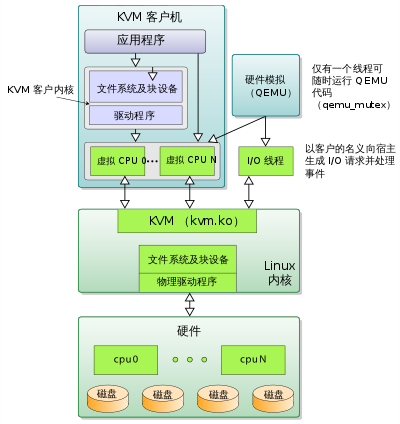
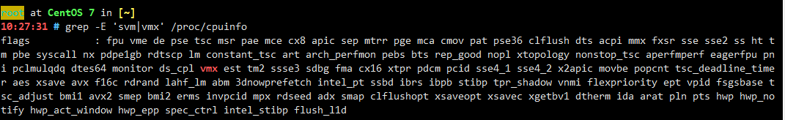
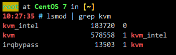
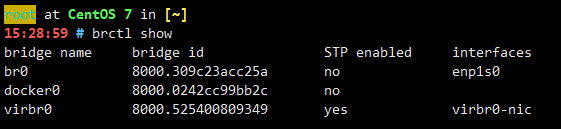
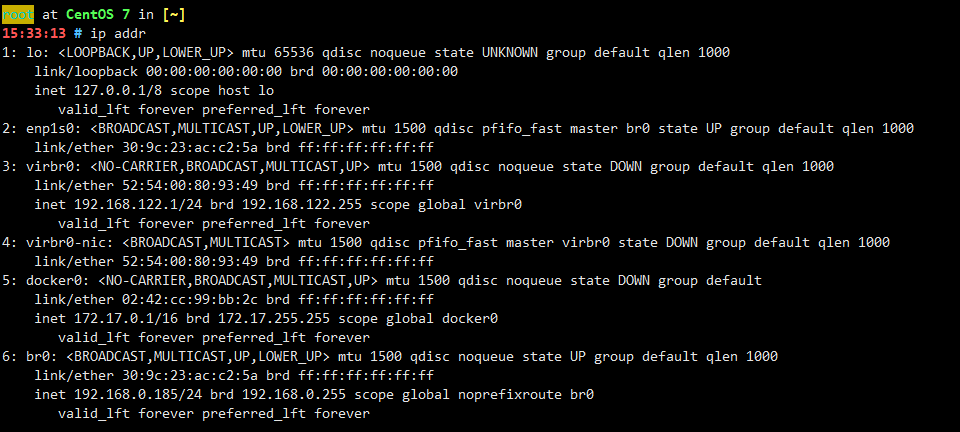
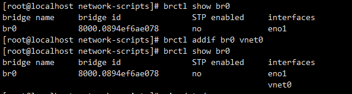

# KVM 的使用

基于内核的虚拟机（Kernel-based Virtual Machine，缩写为 KVM）是一种用于 Linux 内核中的虚拟化基础设施，可将 Linux 内核转化为虚拟机监视器。

[TOC]

## 内部结构^1^

KVM 提供抽象的设备，但不模拟处理器。它开放了 `/dev/kvm` 接口，供使用者模式的主机使用：

- 设置客户虚拟机的地址空间。宿主机也需要可用于引导进操作系统的固件镜像（通常是模拟 PC 时的自定义 BIOS）。
- 为客户机模拟 I/O。
- 将客户机的视频显示映射回系统主机上。

在 Linux 上，QEMU 版本 0.10.0 及更新版就是一个用户层主机，QEMU 使用 KVM 以近乎原生的速度虚拟化客户机，若无 KVM 的话则将仅使用软件模拟。

KVM 内部使用 SeaBIOS 作为 16 位 x86 BIOS 的开源模拟。



## 安装 KVM^4^

- 查看系统是否可以实现虚拟化

  ```bash
  grep -E 'svm|vmx' /proc/cpuinfo
  ```

  如果匹配到这两项中的其中一项，则 CPU 支持虚拟化。

  

- 安装 KVM 软件和相关软件组件（基于 CentOS 7）

  ```bash
  yum install -y qemu-kvm qemu-img libvirt bridge-utils virt-install libvirt-client libvirt-python
  ```

  等待软件安装成功后，输入

  ```bash
  lsmod | grep kvm
  ```

  如果显示下图，则安装成功

  

- 网络配置

   KVM 默认会开启一个虚拟的网络接口 `virbr0`，它创建一个 NAT 网络提供虚拟机接入网络，默认的网络为 192.168.122.0/24。但这个取决与你的系统环境，也可以创建一个桥接网络使虚拟机接入网络。

- 配置 VNC

  当虚拟机需要使用 VNC 时，可以通过下列方式

  1. 默认的 VNC 将会监听 127.0.0.1，这样只有本地的主机可以通过 VNC 接入。如果需要通过其他主机接入 VNC，则需要配置 ‘/etc/libvirt/qemu.conf’ 中的 `vnc_listen = '0.0.0.0'`，将它的注释去掉，并重启 ‘libvirtd’。

     ```bash
     systemctl restart libvirtd
     ```

  2. 设置 SSH 转发（适用于 NAT 网络）

     ```bash
     ssh -L 192.168.0.185:5910:127.0.0.1:5910 192.168.0.185
     192.168.0.185 为主机 IP 地址
     ```

  3. 防火墙开放端口

     ```bash
     iptables -I INPUT -p tcp –dport 5910 -s IP -j ACCEPT
     firewall-cmd  --permanent --add-port=5910/tcp
     ```

- 创建虚拟机

  ```bash
  virt-install \
  --name win7 \ # 虚拟机名称
  --memory 2048 \ # 2G 内存
  --vcpus sockets=1,cores=1,threads=2 \ # 1 个 CPU，1 核，2 线程
  --cdrom=/home/windows7/win7-X86.iso \ # 系统镜像
  --os-type windows # 系统类型
  --accelerate # 优化选项
  --os-variant=win7 \ #^7^
  --disk /home/windows7/win7.qcow2,bus=virtio,size=40 \ # 虚拟系统盘 40G
  --disk /home/windows7/virtio-win_x86.vfd,device=floppy \ # 挂载 virtio 为软盘，提供网络及磁盘驱动
  --graphics vnc,password=Passw0rd,port=5910 \ # 开启 vnc，端口 5910，VNC 密码 Passw0rd
  --hvm # 完全虚拟化，基于 QEMU 的系统管理程序，则隐含此参数
  --virt-type kvm # 安装的系统管理程序。示例是 kvm、qemu、xen 或 kqemu。优先推荐 qemu(软件+硬件虚拟)>kvm(硬件虚拟)>kqemu(软件+硬件虚拟)^6^
  ```

## 添加桥接网络（CentOS7）^8^

- 新增 /etc/sysconfig/network-scripts/ifcfg-br0

  ```bash
  TYPE=Bridge #网络类型
  DEFROUTE=yes
  BOOTPROTO=static
  IPADDR=192.168.0.185
  GATEWAY=192.168.0.253
  NETMASK=255.255.255.0
  DEVICE=br0
  ONBOOT=yes #开机启动
  ```

- 修改 /etc/sysconfig/network-scripts/ifcfg-enp1s0（物理网卡）

  ```bash
  TYPE=Ethernet
  BOOTPROTO=none #手动
  NAME=enp1s0
  DEVICE=enp1s0
  ONBOOT=yes
  BRIDGE=br0 #桥接 br0 设备
  NM_CONTROLLED=no #不由 NetworkManager 管理
  ```

- 重启 network.service 服务

  ```bash
  systemctl restart network
  ```

- 查看桥接接口

  

- 查看 IP 信息

  

- virt-install 内使用桥接网络

  ```bash
  --network bridge=br0,model=virtio
  ```

## 常用操作命令^9^

| 作用                          | 命令                                   |
| ----------------------------- | -------------------------------------- |
| 列出所有虚拟机                | virsh list --all                       |
| 显示虚拟机信息                | virsh dominfo virtual_name             |
| 显示虚拟机内存和cpu的使用情况 | virt-top                               |
| 显示虚拟机分区信息            | virt-df virtual_name                   |
| 关闭虚拟机（shutodwn）        | virsh shutdown virtual_name            |
| 启动虚拟机                    | virsh start virtual_name               |
| 设置虚拟机跟随系统自启        | virsh autostart virtual_name           |
| 关闭虚拟及自启                | virsh autostart --disable virtual_name |
| 删除虚拟机                    | virsh undefine virtual_name            |
| 通过控制窗口登录虚拟机        | virsh console virtual_name             |
| 编辑虚拟机配置                | virsh edit virtual_name                |

1. 删除虚拟机

   ```bash
   virsh shutdown virtual_name #停止虚拟机
   virsh destroy virtual_name #摧毁虚拟机
   virsh undefine  virtual_name #取消定义虚拟机
   rm /home/windows7/win7.qcow2 #删除虚拟磁盘
   ```

2. 桥接网络（bridge）管理

   ```bash
   # 添加网桥
   brctl addbr [name]
   # 显示网桥信息
   brctl show [name]
   # 删除网桥
   brctl delbr [name]
   # 将物理网口添加到网桥
   brctl addif [br-name] [ph-name]
   #brctl addif br0 eth0
   # 将物理网口从网桥中删除
   brctl delif br0 eth0
   ```

3. **删除网桥步骤**

   ```bash
   # 将物理网口从网桥中删除
   brctl delif br0 eno1
   # 关闭网桥
   ifdown br0
   # 删除网桥
   brctl delbr br0
   # 删除配置文件
   mv /etc/sysconfig/network-scripts/ifcfg-br0 /tmp
   ```

## 重点

安装虚拟机后请检查 br0 绑定的虚拟接口，确认虚拟接口是否已经绑定了桥接接口。



如果显示为上一条，一定要将新建虚拟机加上。

```bash
brctl addif br0 vnet0 #绑定 vnet0 至 br0 接口
```

> 1. [基于内核的虚拟机](https://zh.wikipedia.org/zh-hans/基于内核的虚拟机)
> 2. [virtIO下载](https://docs.fedoraproject.org/en-US/quick-docs/creating-windows-virtual-machines-using-virtio-drivers/index.html)
> 3. [KVM 与 CentOS-6](https://wiki.centos.org/zh/HowTos/KVM)
> 4. [Setting up KVM on Red Hat Enterprise Linux](https://developers.redhat.com/blog/2016/08/18/setting-up-kvm-on-rhel/)
> 5. [在 Ubuntu 的 KVM 中安装 Windows 系统](https://www.jianshu.com/p/6cccc7f3e1f9)
> 6. [KVM and QEMU – do you know the connection?](https://cloudbuilder.in/blogs/2014/03/09/kvm-and-qemu/)
> 7. [Os Variants List](https://hwguo.github.io/blog/2015/09/22/os-variants-list-of-virt-install/)
> 8. [CentOS 6.9下KVM虚拟机网络Bridge（网桥）方式与NAT方式详解（转）](https://www.cnblogs.com/EasonJim/p/8367645.html)
> 9. [KVM 操作虚拟机常用命令](https://blog.csdn.net/wh211212/article/details/74908390)
