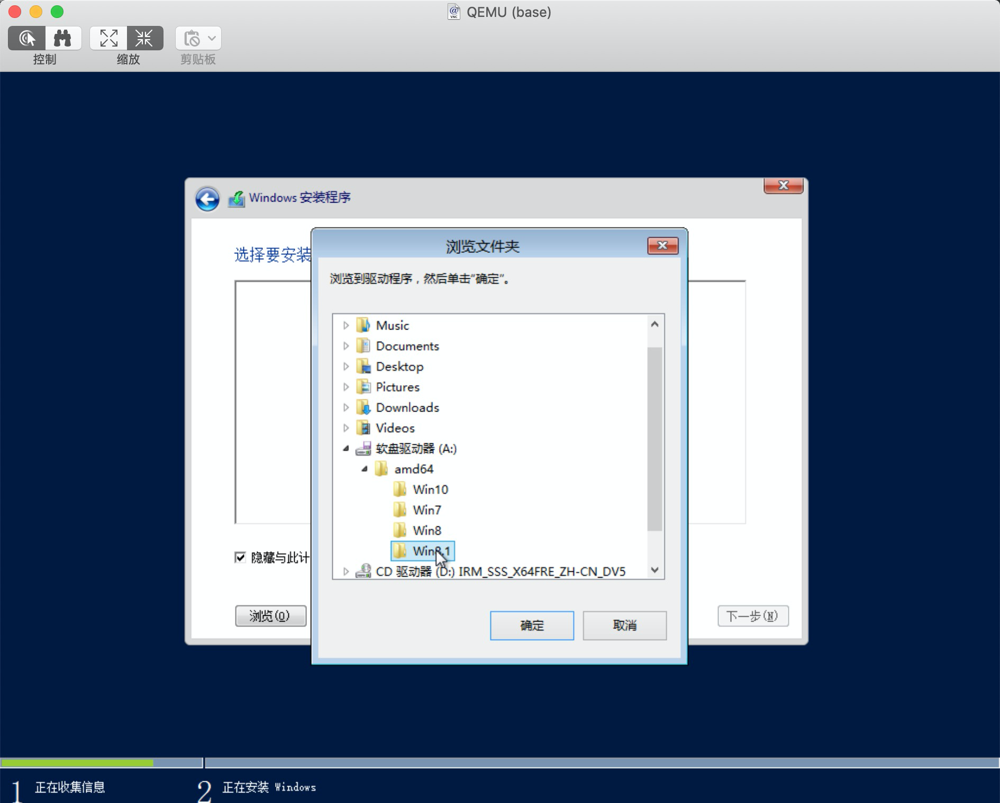

# KVM 使用

Ubuntu 16.04 KVM 安装与使用，包括 KVM 模版与扩容虚拟磁盘。

[TOC]

## 安装 KVM

```bash
apt install -y qemu-kvm virtinst libvirt-bin bridge-utils libguestfs-tools
```

1. `libvirt-bin`提供 libvirt 管理 qemu 和 kvm 实例的 libvirtd。
2. `qemu-kvm`是一个后端。
3. `bridge-utils`提供桥接网络支持。
4. `virtinst`提供 kvm 命令行安装支持。
5. `libguestfs-tools`提供后续制作模版支持。

软件安装后，执行`kvm-ok`，如果显示：

```txt
INFO: /dev/kvm exists
KVM acceleration can be used
```

KVM 可以正常使用。如果显示类似的：

```txt
INFO: Your CPU does not support KVM extensions
KVM acceleration can NOT be used
```

可能仍然能够运行虚拟机，但是速度会很慢。

## 配置桥接网络

编辑`/etc/network/interfaces`：

```txt
auto lo
iface lo inet loopback

auto br0
iface br0 inet static
        address 192.168.0.10  # IP 地址
        netmask 255.255.255.0 # 掩码
        gateway 192.168.0.1   # 网关
        dns-nameservers 192.168.0.5 # DNS 地址
        bridge_ports eth0     # 桥接的物理网口 
        bridge_stp off        # 如果网络有环路的可能，则设置为 on
        bridge_fd 0           # 转发延时
        bridge_maxwait 0      # 等待以太网口启动时间
```

允许路由转发：

```bash
sysctl -w net.ipv4.ip_forward=1
```

重启网络：

```bash
systemctl restart networking
```

## 安装虚拟机

```bash
virt-install --connect=qemu:///system \
    -n <虚拟机名称> --description "win2k12r2" \
    --os-type=win --os-variant=win2k12r2 --ram=<内存大小 KB> --vcpus=<CPU 核数> \
    --disk path=<虚拟磁盘文件>,bus=virtio,format=qcow2,size=<磁盘大小 GB> \
    --network bridge=<桥接网卡名>,model=virtio --accelerate \
    --graphics vnc,listen=0.0.0.0,password=123456,port=5910 \
    --disk <virtio-win 文件>,device=floppy \
    --cdrom=<ISO 文件>
```

示例：

```bash
virt-install --connect=qemu:///system \
    -n base --description "win2k12r2" \
    --os-type=win --os-variant=win2k12r2 --ram=2048 --vcpus=2 \
    --disk path=/data/base.qcow2,bus=virtio,format=qcow2,size=50 \
    --network bridge=br0,model=virtio --accelerate \
    --graphics vnc,listen=0.0.0.0,password=123456,port=5910 \
    --disk /home/kk/Downloads/virtio-win-0.1.185_amd64.vfd,device=floppy \
    --cdrom=/home/kk/Downloads/cn_windows_server_2012_r2_x64_dvd_2707961.iso
```

命令执行后，通过 VNC 连接主机 IP:5910 进行后续安装。

MacOS 可以通过*屏幕共享*进行 VNC 连接，或通过 [realvnc](https://www.realvnc.com/) 工具连接。

**安装 Win 系统，需要在安装向导中加载 virtio 驱动（驱动在之前挂载的软盘中，需要将 Ethernet 和 SCSI 都安装）**：




## 获取虚拟机 IP

先获取虚拟机 mac 地址：`mac_address="$(virsh dumpxml ${安装时虚拟机的名称} | awk -F\' '/mac address/{print $2}')"`

然后获取 IP 地址：`arp -n | grep -i ${mac_address} | awk '{print $1}'`

## 制作 KVM 模版

1. 暂停虚拟机：`virsh shutdown base`

2. 导出虚拟机 XML 文件：`virsh dumpxml --domain base > /data/base.xml`

3. 将`/data/base.xml`文件中`uuid`，`name`，`mac 地址`，以及在安装时挂载上的软盘与 ISO 镜像的 disk 删除。

4. 在`vnc`段添加`passwd='123456'`，如`<graphics type='vnc' port='5910' passwd='123456' autoport='no' listen='0.0.0.0'>` 。

5. 拷贝之前虚拟机磁盘文件：`cp /data/base.qcow2 /data/base-disk.qcow2 `

6. 清除磁盘文件中一些特定信息：`virt-sysprep -a /data/base-disk.qcow2`

7. 从模版中启动虚拟机：

   ```bash
   virt-clone --connect qemu:///system \
         --original-xml <KVM 模版文件，/data/base.xml> \
         --name <新虚拟机名称，kvm2> \
         --file <新虚拟机磁盘文件，/data/kvm2.qcow2>
   ```

8. 启动新虚拟机：`virsh start kvm2`

9. 查看 VNC 端口：`virsh dumpxml kvm2 | grep vnc`

10. 通过 VNC 连接：主机 IP:Port

## 扩容 KVM 磁盘

1. 获取虚拟磁盘信息：`qemu-img info /data/kvm2.qcow2`
2. 增加 20G 容量：`qemu-img resize /data/kvm2.qcow2 +20G`
3. 重启虚拟机后，在`控制面板 - 计算机管理 - 磁盘管理`，将新加的容量通过`扩容卷`扩容到 C 盘。

## KVM 基础命令

1. 停止虚拟机：`virsh shutdown <虚拟机名>`
2. 强制停止虚拟机：`virsh destroy <虚拟机名>`
3. 删除虚拟机：`virsh undefine <虚拟机名>`，虚拟磁盘需手动删除
4. 启动虚拟机：`virsh start <虚拟机名>` 
5. 设置虚拟机开机自启：`virsh autostart <虚拟机名>`

> [KVM Installation](https://help.ubuntu.com/community/KVM/Installation)
