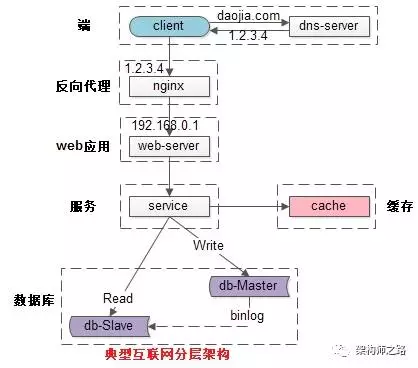

# 高并发^1^

高并发（High Concurrency）通常是指**通过设计保证系统能够同时并行处理很多请求**。

[TOC]

## 指标

高并发指标有：**响应时间**（Response Time），**吞吐量**（Throughput），**每秒查询率 QPS**（Query Per Second），**并行用户数**等。

`并发`：处理多个任务的能力，不一定同时。

`并行`：同时处理多个任务的能力。

`响应时间`：系统对请求作出的响应的时间。

`吞吐量`：单位时间处理的请求数量。

`QPS`：每秒相应请求数。

`并发用户数`：同时承载正常使用系统功能的用户数量。

## 提升系统并发能力

### 垂直扩展

1. #### 扩展方式
   
   1. 增加硬件性能。例如增加 CPU，升级内存，使用 SSD 等。
   2. 提升单机架构性能。使用 Cache 来减少 IO 次数，使用异步增加单服务器吞吐量，使用无锁数据结构来减少响应时间。
   
2. #### 缺点：

   1. 资源的争用，服务器性能增长会越来越小。

   2. 有硬件故障导致服务不可用的风险。
   3. 扩展升级的空间有限。

### 水平扩展

1. #### 扩展方式
   
      1. 增加多台相同配置的服务器。
      
2. #### 缺点
   
      1. 服务器维护和管理更加麻烦。
      2. 如果使用付费授权软件，会增加 Lisence 的费用。
## 总结^1^

互联网分层架构中，各层次**水平扩展**的实践有所不同：

  1. 反向代理层可以通过 “DNS 轮询” 的方式来进行水平扩展；
  2. 站点层可以通过 Nginx 来进行水平扩展；
  3. 服务层可以通过服务连接池来进行水平扩展；
  4. 数据库可以按照数据范围，或者数据哈希的方式来进行水平扩展；

 

> 1. [究竟啥才是互联网架构“高并发”](<https://mp.weixin.qq.com/s?__biz=MjM5ODYxMDA5OQ==&mid=2651959830&idx=1&sn=ce1c5a58caed227d7dfdbc16d6e1cea4&chksm=bd2d07ca8a5a8edc45cc45c4787cc72cf4c8b96fb43d2840c7ccd44978036a7d39a03dd578b5&scene=21#wechat_redirect>)
> 2. [负载均衡集群 LVS 详解](<http://liaoph.com/lvs/>)
> 3. [理解水平扩展和垂直扩展](https://yunjiechao-163-com.iteye.com/blog/2124949)