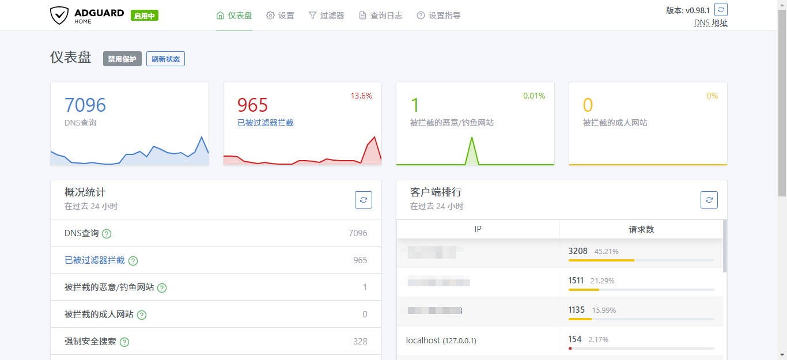
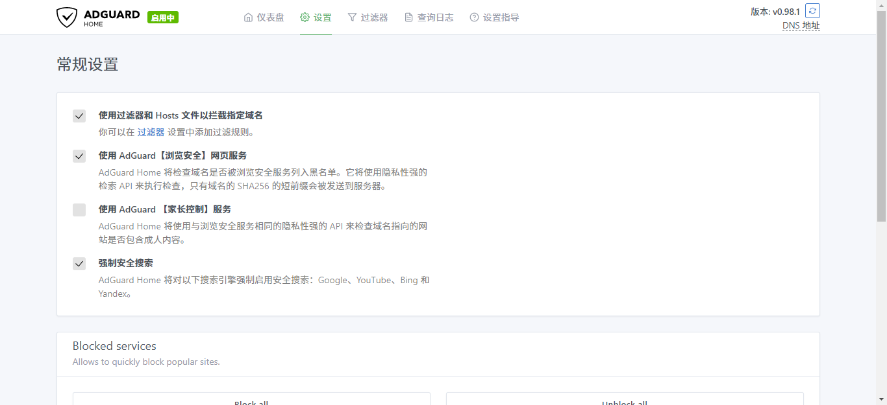
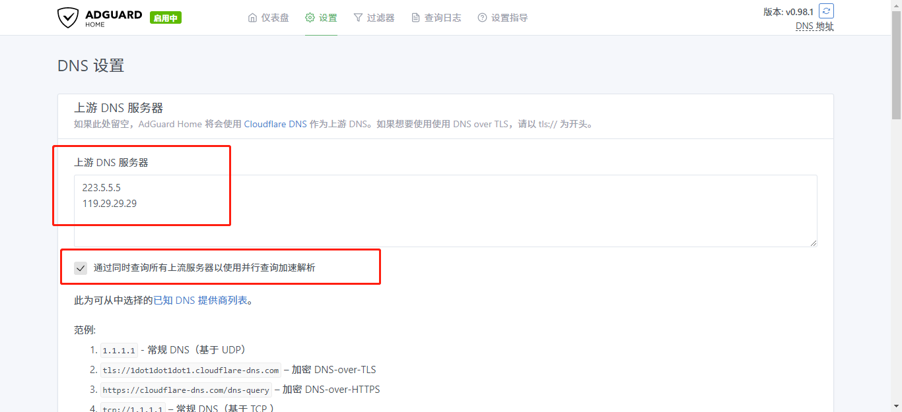
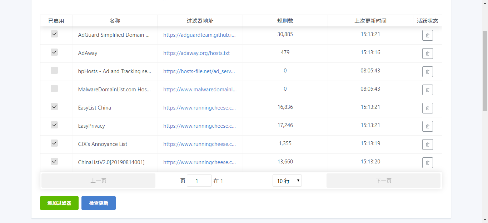
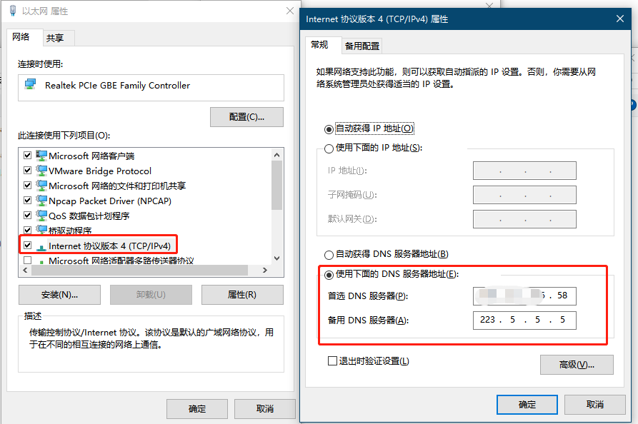
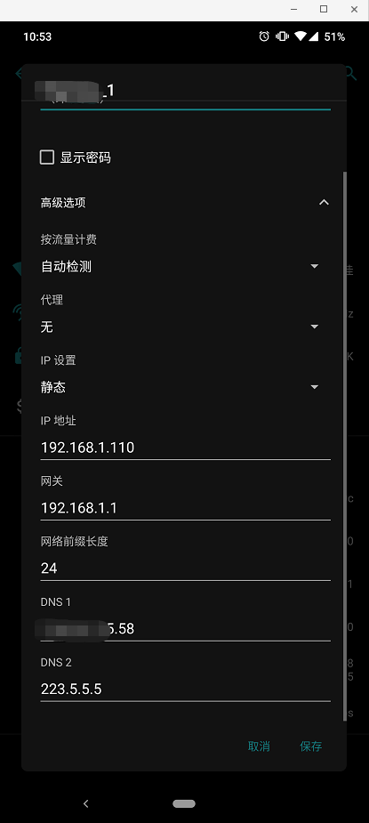

# AdGuard Home

> AdGuard Home is a network-wide software for blocking ads & tracking. After you set it up, it'll cover ALL your home devices, and you don't need any client-side software for that.
>
> It operates as a DNS server that re-routes tracking domains to a "black hole," thus preventing your devices from connecting to those servers.
>
> AdGuard Home 是一个阻止广告和追踪的网络软件。设置完成后，它将覆盖所有的家用设备，并且不需要安装任何的客户端，
>
> 它作为 DNS 服务器，将追踪的域名路由到 “黑洞” 中，从而防止你的设备连接这些服务。

[TOC]

## 下载 AdGuard Home

浏览 [AdGuard 官方 Github](https://github.com/AdguardTeam/AdGuardHome)，README 和 Wiki 中有详细的项目介绍和快速开始，有兴趣的可以阅读。

[官方下载地址](https://github.com/AdguardTeam/AdGuardHome/releases)：请根据自己的服务器架构选择下载。

## 配置 AdGuard Home

### 解压压缩包

```bash
# 当前最新的版本为 0.98.1
$tar zxvf AdGuardHome_linux_amd64.tar.gz
AdGuardHome/
AdGuardHome/LICENSE.txt
AdGuardHome/AdGuardHome
AdGuardHome/README.md
```

### 移动执行文件

```bash
# 将可执行文件移动到 /usr/local/bin 下
$mv AdGuardHome /usr/local/bin
```

### 启动服务

```bash
#AdGuardHome -s install
2019/09/24 21:01:24 [info] Service control action: install
2019/09/24 21:01:24 [info] Action install has been done successfully on linux-systemd
2019/09/24 21:01:24 [info] Service has been started
2019/09/24 21:01:24 [info] Almost ready!
AdGuard Home is successfully installed and will automatically start on boot.
There are a few more things that must be configured before you can use it.
Click on the link below and follow the Installation Wizard steps to finish setup.
2019/09/24 21:01:24 [info] AdGuard Home is available on the following addresses:
2019/09/24 21:01:24 [info] Go to http://127.0.0.1:3000
2019/09/24 21:01:24 [info] Go to http://172.17.0.10:3000
```

### 配置防火墙

```bash
# 允许 AdGuardHome 的 WEB 界面
#iptables -I INPUT -p tcp --dport 3000 -j ACCEPT
# 允许 DNS UDP 53 端口
#iptables -I INPUT -p udp --dport 53 -j ACCEPT
```

### 访问 WEB 界面




### WEB 页面中配置

1. #### 常规配置

   建议 “使用 AdGuard【浏览安全】网页服务” 和 “强制安全搜索” 也选择。

   


2. #### DNS 设置

   上游服务器，国内阿里和腾讯的 DNS 相对还可靠，所以设置上游 DNS 服务器为这两家的。

   建议选上 ”通过同时查询所有上流服务器以使用并行查询加速解析“ 加速解析。

   

   

3. #### 配置过滤器

   因为官方的广告规则不太适合国内的情况，所以添加一些适合国情的的源。

   下列是一些建议的源：

   1. [EasyList China](https://www.runningcheese.com/go?url=https://easylist-downloads.adblockplus.org/easylistchina.txt)：EasyList China 的官方源。
   2. [EasyPrivacy](https://www.runningcheese.com/go?url=https://easylist-downloads.adblockplus.org/easyprivacy.txt)：隐私防护。
   3. [CJX's Annoyance List](https://www.runningcheese.com/go?url=https://raw.githubusercontent.com/cjx82630/cjxlist/master/cjx-annoyance.txt)：同样是隐私防护。
   4. [ChinaList](https://www.runningcheese.com/go?url=http://tools.yiclear.com/ChinaList2.0.txt)：视频广告拦截。

   
   
   


## 使用 AdGuard Home

### Windows 设置

将首选 DNS 设置为部署 AdGurad Home 的 IP。




### Android 设置

在 WIFI 的设置界面，选择静态 IP。




## 域名访问 WEB 配置页面

### 使用 Nginx 反代

```json
...
location / {
        proxy_pass http://127.0.0.1:3000;
          
        proxy_set_header   Host             $host;
        proxy_set_header   X-Real-IP        $remote_addr;
        proxy_set_header   User-Agent       $http_user_agent;
        proxy_set_header   X-Forwarded-For  $proxy_add_x_forwarded_for;
}
...
```

## 完整 AdGuard Home 配置

```yaml
bind_host: 0.0.0.0
bind_port: 3000
auth_name: username
auth_pass: Passwd
language: zh-cn
rlimit_nofile: 0
dns:
  bind_host: 0.0.0.0
  port: 53
  protection_enabled: true
  filtering_enabled: true
  blocking_mode: nxdomain
  blocked_response_ttl: 60
  querylog_enabled: true
  ratelimit: 20
  ratelimit_whitelist: []
  refuse_any: true
  bootstrap_dns:
  - 1.1.1.1:53
  - 1.0.0.1:53
  - 8.8.8.8:53
  all_servers: true
  allowed_clients: []
  disallowed_clients: []
  blocked_hosts: []
  parental_block_host: ""
  safebrowsing_block_host: ""
  blocked_services: []
  parental_sensitivity: 0
  parental_enabled: false
  safesearch_enabled: true
  safebrowsing_enabled: true
  resolveraddress: ""
  rewrites: []
  # 上游 DNS
  # 国内可选 223.5.5.5
  upstream_dns:
  - https://1.1.1.1/dns-query
  - https://1.0.0.1/dns-query
tls:
  enabled: false
  server_name: ""
  force_https: false
  port_https: 443
  port_dns_over_tls: 853
  certificate_chain: ""
  private_key: ""
filters:
- enabled: true
  url: https://adguardteam.github.io/AdGuardSDNSFilter/Filters/filter.txt
  name: AdGuard Simplified Domain Names filter
  id: 1
- enabled: true
  url: https://adaway.org/hosts.txt
  name: AdAway
  id: 2
- enabled: false
  url: https://hosts-file.net/ad_servers.txt
  name: hpHosts - Ad and Tracking servers only
  id: 3
- enabled: false
  url: https://www.malwaredomainlist.com/hostslist/hosts.txt
  name: MalwareDomainList.com Hosts List
  id: 4
- enabled: true
  url: https://www.runningcheese.com/go?url=https://easylist-downloads.adblockplus.org/easylistchina.txt
  name: EasyList China
  id: 1569222181
- enabled: true
  url: https://www.runningcheese.com/go?url=https://easylist-downloads.adblockplus.org/easyprivacy.txt
  name: EasyPrivacy
  id: 1569222182
- enabled: true
  url: https://www.runningcheese.com/go?url=https://raw.githubusercontent.com/cjx82630/cjxlist/master/cjx-annoyance.txt
  name: CJX's Annoyance List
  id: 1569222183
- enabled: true
  url: https://www.runningcheese.com/go?url=http://tools.yiclear.com/ChinaList2.0.txt
  name: ChinaListV2.0[20190814001]
  id: 1569222184
user_rules:
- '@@mp4.ts'
- '@@||www.google.cn^$important'
- ""
dhcp:
  enabled: false
  interface_name: ""
  gateway_ip: ""
  subnet_mask: ""
  range_start: ""
  range_end: ""
  lease_duration: 86400
  icmp_timeout_msec: 1000
clients: []
log_file: ""
verbose: false
schema_version: 4
```

