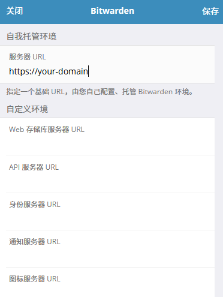

# Bitwarden Rs 搭建密码管理服务

> This is a Bitwarden server API implementation written in Rust compatible with upstream Bitwarden clients*, perfect for self-hosted deployment  where running the official resource-heavy service might not be ideal.
>
> bitwarden_rs 是通过 Rust 编写的 Bitwarden 服务 API，兼容 Bitwarden 客户端。非常适合在官方资源密集型服务可能不理想的情况下自己搭建部署。

[TOC]

## 特性

### 已支持的特性

基本提供了 Bitwarden API 的完整实现，包括：

- 基本单用户功能
- 组织支持
- 附件
- 保管箱(Vault) API
- 网站 icon API
- 身份验证器和 U2F 支持
- YubiKey OTP
- Duo Security

### 未支持的特性

- 邮件确认
- 其他两步验证系统：
  - Email codes
- 其他[未实现特性](https://github.com/dani-garcia/bitwarden_rs/issues/246)

## 搭建

### 容器选择

请根据服务器架构选择对应的[容器镜像](https://github.com/dani-garcia/bitwarden_rs/wiki/Which-container-image-to-use)。

bitwarden_rs 现在支持`amd64`,`armv6`,`alpine`,`raspberry`,`aarch64`架构。

通过 `docker version | grep OS/Arch` 或 `uname -a` 查看当前服务器的架构。

### 启动容器

#### CMD 方式

```bash
# 使用 Docker:
docker run -d --name bitwarden -v /bw-data/:/data/ -p 80:80 bitwardenrs/server:latest
# 使用 Podman:
podman run -d --name bitwarden -v /bw-data/:/data/:Z -e ROCKET_PORT=8080 -p 8080:8080 bitwardenrs/server:latest
```

这将对外暴露 80 或者 8080 端口，数据将存储在 `/bw-data/`。

#### Docker Compose 方式

**推荐使用此种方式搭建。**

创建 `docker-compose.yaml`文件

```yaml
version: "3"

services:
  bitwarden:
    image: bitwardenrs/server
    restart: always
    volumes:
      - ./bitwarden-data:/data
    ports:
      - 127.0.0.1:8200:80
      - 127.0.0.1:3012:3012
    environment:
      # 域名
      DOMAIN: "https://your-domain.com"
      # 启动 WEBSOCKET
      WEBSOCKET_ENABLED: "true"
      # 日志等级
      LOG_LEVEL: "info"
      # 日志记录路径
      LOG_FILE: "/data/bitwarden.log"
```

启动

```bash
docker-compose up -d
```

停止

```bash
docker-compose down
```

更新基础镜像或配置

```bash
docker-compose stop && docker-compose start
```

## 自定义选项

1. `SIGNUPS_ALLOWED`: 是否允许注册。

2. `INVITATIONS_ALLOWED`: 是否允许邀请注册。即使禁用了注册功能，组织管理者也可以通过邀请其他用户来注册使用。

3. `ADMIN_TOKEN`: 设置 Admin 密钥。通过`/admin`访问 Admin 页面，详细查看[Enabling admin page](https://github.com/dani-garcia/bitwarden_rs/wiki/Enabling-admin-page)。

4. `WEBSOCKET_ENABLED`: 开启 WebSocket 通知，**不适用移动客户端**。如果开启此项功能，还需在代理（Nginx， Caddy）服务中配置相应路由，Nginx 可参考下列配置：

   ```nginx
   location /notifications/hub {
       proxy_pass http://127.0.0.1:3012;
       proxy_set_header Upgrade $http_upgrade;
       proxy_set_header Connection "upgrade";
   }  

   location /notifications/hub/negotiate {
       proxy_pass http://127.0.0.1:8200;
   }
   ```

   其他示例查看 [Proxy examples](https://github.com/dani-garcia/bitwarden_rs/wiki/Proxy-examples)。

5. `LOG_LEVEL`: 日志记录等级，"trace", "debug", "info", "warn", "error" 和 "off"。推荐使用`info`等级。

6. `SMTP` 配置：

   ```yaml
   SMTP_HOST=<smtp.domain.tld>
   SMTP_FROM=<bitwarden@domain.tld>
   SMTP_PORT=625
   SMTP_SSL=true
   SMTP_USERNAME=<username>
   SMTP_PASSWORD=<password>
   ```

   请按需修改。

7. 其他官方完整[Wiki](https://github.com/dani-garcia/bitwarden_rs/wiki)。

## Nginx 配置

示例 Nginx 配置：

```nginx
server {
    listen   443 ssl http2;
    server_name  your-domain;

    ssl_certificate      your-domain.cer;
    ssl_certificate_key  your-domain.key;
    ssl_protocols TLSv1.3 TLSv1.2;
    ssl_prefer_server_ciphers on;
    ssl_ciphers TLS13-AES-256-GCM-SHA384:TLS13-CHACHA20-POLY1305-SHA256:TLS13-AES-128-GCM-SHA256:TLS13-AES-128-CCM-8-SHA256:TLS13-AES-128-CCM-SHA256:ECDHE-ECDSA-AES256-GCM-SHA384:ECDHE-RSA-AES256-GCM-SHA384:ECDHE-ECDSA-CHACHA20-POLY1305:ECDHE-RSA-CHACHA20-POLY1305:ECDHE-ECDSA-AES128-GCM-SHA256:ECDHE-RSA-AES128-GCM-SHA256;
    ssl_session_cache    shared:SSL:3m;
    ssl_session_timeout  6m;

    client_max_body_size 128M;

    location / {
        proxy_pass http://127.0.0.1:8200;
        proxy_read_timeout 60;
        proxy_connect_timeout 60;
        proxy_redirect     off;
  
        proxy_set_header    Host              $host;
        proxy_set_header    X-Real-IP         $remote_addr;
        proxy_set_header    User-Agent        $http_user_agent;
        proxy_set_header    X-Forwarded-For   $proxy_add_x_forwarded_for;
        proxy_set_header    X-Forwarded-Proto $scheme;
    }

    location /notifications/hub {
        proxy_pass http://127.0.0.1:3012;
        proxy_set_header Upgrade $http_upgrade;
        proxy_set_header Connection "upgrade";
    }

    location /notifications/hub/negotiate {
        proxy_pass http://127.0.0.1:8200;
    }
}
```

## 使用

浏览器访问你的域名或 IP，注册使用即可。如果不准备提供服务给其他人使用，建议关闭注册功能。

浏览器扩展或者客户端软件使用[官方 Bitwarden](https://bitwarden.com/) 即可。火狐扩展 [Bitwarden 地址](https://addons.mozilla.org/zh-CN/firefox/addon/bitwarden-password-manager/)。

**注意：**不论浏览器扩展或者客户端软件，都需要点击首页左上角的齿轮，修改**自我托管环境**为**自己的域名或 IP**。



> [官方 Bitwarden Rs Github](https://github.com/dani-garcia/bitwarden_rs)
