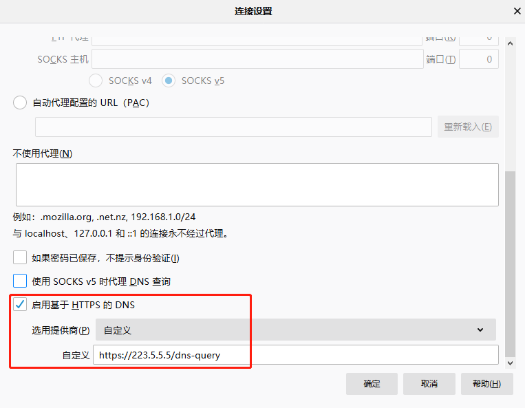
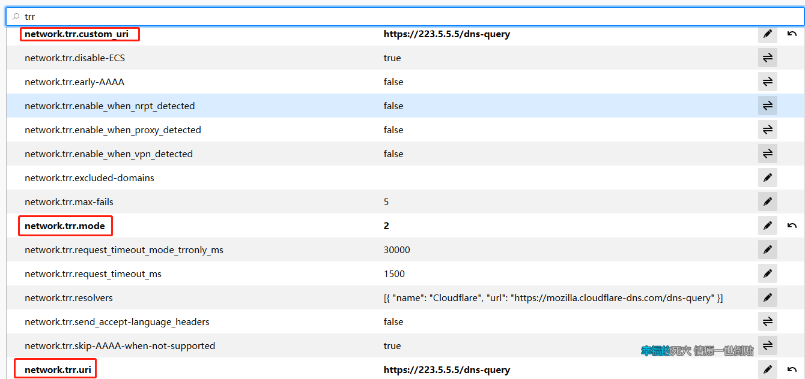
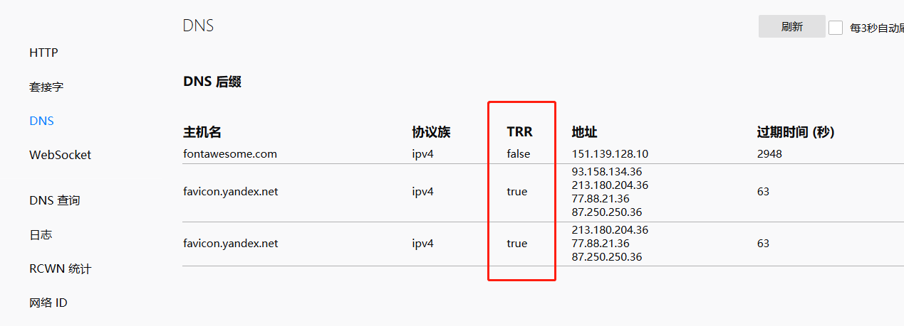

# Firefox 使用 DOH

> DNS-over-HTTPS (DoH) sends the domain name you typed to a DoH-compatible DNS server using an encrypted HTTPS connection instead of a plain text one. This prevents third-parties from seeing what websites you are trying to access.
>
> DOH 使用加密的 HTTPS 连接而不是纯文本发送查询信息到 DNS 服务器。这可以防止第三方获取你访问的网站。

[TOC]

## 益处

> DoH improves privacy by hiding domain name lookups from someone lurking on public WiFi, your ISP, or anyone else on your local network. DoH, when enabled, ensures that your ISP cannot collect and sell personal information related to your browsing behavior.
>
> DOH 通过在公共 Wi-Fi，ISP 或本地网络上隐藏域名查找改善隐私，防止潜在的风险。 DOH 启用时，确保您的 ISP 无法收集和出售与您的浏览行为相关的个人信息。

## 第三方 DOH 地址

### 国内

#### 阿里

- `https://223.5.5.5/dns-query`
- `https://223.6.6.6/dns-query`

#### 360

- `https://doh.360.cn/dns-query`

#### GeekDNS

- `https://i.233py.com/dns-query`

### 国外

#### Cloudflare

- `https://1.1.1.1/dns-query`
- `https://1.0.0.1/dns-query`

#### Google

- `https://dns.google/dns-query`

## 开启 DOH

### 选项中设置

**推荐使用此方法。**

1. 打开选项(`about:preferences`)。

2. 选择*网络设置*。

3. 开启*启用基于 HTTPS 的 DNS*，并填入 DNS 地址。

   推荐使用国内提供的 DOH，主要是为了防止 ISP 的 dns 污染，也不做其他用途:oncoming_police_car:。

   

### 高级首选项中设置

1. 地址栏输入`about:config`，并确认接受风险。

2. 搜索`trr`。

3. 按示例修改：

   

4. `network.trr.mode`

   - 0 — **Off** (默认)。使用操作系统解析程序。
   - 1 — **Race** native against TRR。并行执行并与首先返回结果的那个一起执行。最有可能的是本地将获胜。
   - 2 — **First**。首先使用 TRR，并且仅当安全解决方案失败时才使用操作系统解析程序。
   - 3 — **Only**。只使用 TRR。不使用原生（初始设置后）。
   - 4 — **Shadow**。运行 TRR 与本机并行进行定时和测量，但仅使用本机解析器结果。
   - 5 — **Off by choice**。与 0 相同。

## 验证

1. 地址栏输入`about:networking#dns`。

2. 查看 *TRR* 列：

   

   - 如果 *TRR*  列存在`true`，则表示 DOH 开启成功。
   - 如果  *TRR*  列都是`false`，则重启浏览器重试或更换 DOH 地址。

> [Firefox DNS-over-HTTPS](https://support.mozilla.org/en-US/kb/firefox-dns-over-https)
>
> [GeekDNS](https://www.233py.com/#dnsservice)
>
> [DNS-over-HTTPS](https://developers.google.com/speed/public-dns/docs/doh)
>
> [Running a DNS over HTTPS Client](https://developers.cloudflare.com/1.1.1.1/dns-over-https/cloudflared-proxy/)
