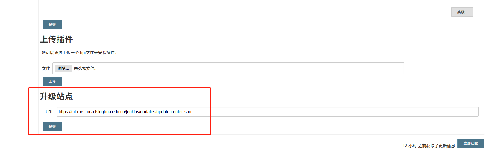

# Jenkins 加速下载插件(Plugins)

## 调整升级站点

依次点击*Jenkins -> 插件管理 -> 高级(Jenkins -> Manage Plugins -> Advanced)* ，修改 URL 为`https://mirrors.tuna.tsinghua.edu.cn/jenkins/updates/update-center.json`，并提交。



*此步骤不做也没关系。*

## 调整 Json 文件

**此步骤需要到安装 Jenkins 的服务器上操作。**

1. 切换当前目录到 Jenkins 家目录的 updates 文件夹下

   ```bash
   cd ${JENKINS_HOME}/updates/
   ```

   如果是 Docker 安装，可能需要`docker exec -it ${Contain_name} bash`，进入容器进行修改。

   如果是通过 Tomcat 安装，家目录可能在`~/.jenkins`。

2. 修改 default.json

   ```bash
   sed -i 's|http://updates.jenkins-ci.org/download|https://mirrors.tuna.tsinghua.edu.cn/jenkins|g' default.json
   sed -i 's|http://www.google.com|https://www.baidu.com|g' default.json
   ```

## 重启 Jenkins
