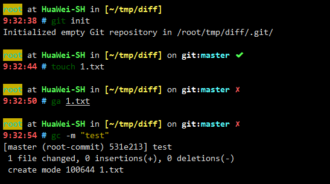
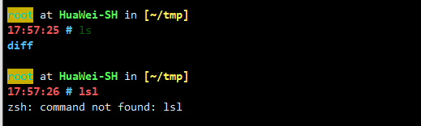

# Oh My Zsh 主题分享

> Oh My Zsh is an open source, community-driven framework for managing your [zsh](https://www.zsh.org/) configuration.
>
> Oh My Zsh 是一个开源的、社区驱动的，用于管理 Zsh 配置的框架。

## 安装 Oh My Zsh

### 安装必要的依赖

```bash
apt install zsh curl git
```

### 安装

```bash
sh -c "$(curl -fsSL https://raw.githubusercontent.com/ohmyzsh/ohmyzsh/master/tools/install.sh)"
```

## 主题配置

### 主题添加

```shell
cat > ~/.oh-my-zsh/themes/hsin.zsh-theme << EOF
# Copy and self modified from xxf.zsh-theme.
# It is recommended to use with a dark background.
# Colors: black, red, green, yellow, blue, magenta, cyan, and white.

# Machine name.
local box_name='$([ -f ~/.box-name ] && cat ~/.box-name || echo $HOST)'

# Directory info.
local current_dir='${PWD/#$HOME/~}'

# VCS
YS_VCS_PROMPT_PREFIX1="%{$fg[white]%}on %{$reset_color%}%{$fg_bold[white]%}"
YS_VCS_PROMPT_PREFIX2=":%{$fg_bold[cyan]%}"
YS_VCS_PROMPT_SUFFIX="%{$reset_color%} "
YS_VCS_PROMPT_DIRTY=" %{$fg[red]%}✗"
YS_VCS_PROMPT_CLEAN=" %{$fg[green]%}✔ "

# Git info.
local git_info='$(git_prompt_info)'
ZSH_THEME_GIT_PROMPT_PREFIX="${YS_VCS_PROMPT_PREFIX1}git${YS_VCS_PROMPT_PREFIX2}"
ZSH_THEME_GIT_PROMPT_SUFFIX="$YS_VCS_PROMPT_SUFFIX"
ZSH_THEME_GIT_PROMPT_DIRTY="$YS_VCS_PROMPT_DIRTY"
ZSH_THEME_GIT_PROMPT_CLEAN="$YS_VCS_PROMPT_CLEAN"

# Prompt format: USER at MACHINE in [DIRECTORY] on git:BRANCH STATE \n TIME $
PROMPT="
%{$fg_bold[cyan]%}%n%{$reset_color%} \
%{$fg[white]%}at \
%{$fg_bold[green]%}${box_name}%{$reset_color%} \
%{$fg[white]%}in \
%{$terminfo[bold]$fg[yellow]%}[${current_dir}]%{$reset_color%} \
${git_info}
%{$fg_bold[red]%}%* \
%{$terminfo[bold]$fg[blue]%}$ %{$reset_color%}"

if [[ "$USER" == "root" ]]; then
PROMPT="
%{$bg[yellow]%}%{$fg[cyan]%}%n%{$reset_color%} \
%{$fg[white]%}at \
%{$fg_bold[green]%}${box_name}%{$reset_color%} \
%{$fg[white]%}in \
%{$terminfo[bold]$fg[yellow]%}[${current_dir}]%{$reset_color%} \
${git_info}
%{$fg_bold[red]%}%* \
%{$terminfo[bold]$fg[blue]%}# %{$reset_color%}"
fi
EOF
```

### 使用主题

```bash
vim ~/.zshrc
```

配置`ZSH_THEME=`的值：

```shell
ZSH_THEME="hsin"
```

### 主题展示



## 解决数字小键盘无效问题

执行下方 Shell：

```shell
cat >> ~/.zshrc << EOF
###########
## Keypad
## 0 . Enter
bindkey -s "^[Op" "0"
bindkey -s "^[Ol" "."
bindkey -s "^[OM" "^M"
## 1 2 3
bindkey -s "^[Oq" "1"
bindkey -s "^[Or" "2"
bindkey -s "^[Os" "3"
## 4 5 6
bindkey -s "^[Ot" "4"
bindkey -s "^[Ou" "5"
bindkey -s "^[Ov" "6"
## 7 8 9
bindkey -s "^[Ow" "7"
bindkey -s "^[Ox" "8"
bindkey -s "^[Oy" "9"
## + - * /
bindkey -s "^[Ok" "+"
bindkey -s "^[Om" "-"
bindkey -s "^[Oj" "*"
bindkey -s "^[Oo" "/"
##############
EOF
```

## 插件推荐

1. [zsh-syntax-highlighting](https://github.com/zsh-users/zsh-syntax-highlighting)

   这个插件可以使当前命令高亮，同时可以通过颜色判断命令的正确性。

   

2. z

   会记录你的路径访问历史，用以快速跳转路径。

### 使用插件

```bash
vim ~/.zshrc
```

配置`plugins`的值：

```bash
plugins=(
    git
    zsh-syntax-highlighting
    z
)
```

> [ohmyzsh](https://github.com/ohmyzsh/ohmyzsh)
>
> [zsh-syntax-highlighting](https://github.com/zsh-users/zsh-syntax-highlighting)
