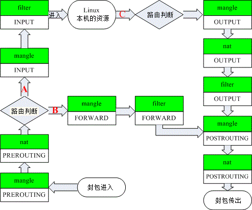

1. ##### 4表5链^1^

   1. ###### 表

      - **filter表**：包过滤功能。只能作用在：INPUT(处理来自外部的数据。), FORWARD(将数据转发到本机的其他网卡设备上), OUTPUT(处理向外发送的数据)。
      - **nat表**：网络地址转换功能。只能作用在：PREROUTING(转换数据包中的目标IP地址,通常用于DNAT), OUTPUT(处理本机产生的数据包), POSTROUTING(转换数据包中的源IP地址,通常用于SNAT)。
      - **managle表**：数据包修改（QOS），用于实现服务质量。5个链都可作用：PREROUTING，INPUT，FORWARD，OUTPUT，POSTROUTING。
      - **raw表**：高级功能，如：网址过滤。作用于：PREROUTING，OUTPUT。
      - 表优先级：raw > managle > nat > filter。

   2. ###### 链^2^

      - **PREROUTING**: 数据包进入路由表之前.
      - **INPUT**: 通过路由表后目的地为本机.
      - **FORWARDING**: 通过路由表后, 目的地不为本机.
      - **OUTPUT**: 由本机产生, 向外转发.
      - **POSTROUTIONG**: 发送到网卡接口之前.

      

      

   3. ###### 动作

      - **ACCEPT** ：接收数据包。
      - **DROP** ：丢弃数据包，不回应。
      - **REJECT**：拒绝数据包，会给发送端回应。
      - **REDIRECT** ：重定向、映射、透明代理。
      - **SNAT** ：源地址转换。
      - **DNAT** ：目标地址转换。
      - **MASQUERADE** ：IP伪装（NAT）。
      - **LOG** ：只记录日志，然后将数据包传递给下一条规则。

> 1. [iptables详解](<http://www.zsythink.net/archives/1199>)
> 2. [iptables用例](<https://wangchujiang.com/linux-command/c/iptables.html>)
>
> 2. [Linux防火墙与iptables介绍(以及4表5链概念)](<http://www.mikewootc.com/wiki/linux/usage/linux_firewall_iptables_intro.html>)
> 3. [iptables详细教程：基础、架构、清空规则、追加规则、应用实例](https://lesca.me/archives/iptables-tutorial-structures-configuratios-examples.html)