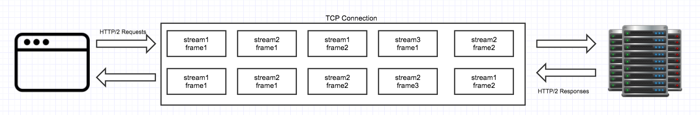

		多路复用是在一个TCP连接中异步传输多个HTTP请求和回应。多路复用是HTTP/2.0协议的重点。

### 帧和流

​		HTTP/2是一个二进制协议。每个HTTP/2请求和回应都有一个独一无二的流ID（stream id），请求和回应分为一个个帧。帧是二进制数据。流id被用于认证这个帧属于那个请求或回应。流是具有相同流id的帧的集合。

​		对于一个HTTP请求，首先客户端将请求分为二进制帧，并将请求的流ID分配给帧，然后建立和服务端的TCP连接，接着客户端发送帧给服务端。一旦服务端准备好响应，它就会将响应分为帧，并提供相同的响应流ID。服务端以帧为单位发送响应。

​		流ID是必须的，因为在一个TCP连接上，相同的客户端发送多个请求，使用流ID可以确定这个帧是属于哪一个请求或回应。

### 多个HTTP请求

​		单个TCP连接可用于向单个源发出HTTP请求。对于多个源，需要多个TCP连接。

​		建立TCP连接建立后，这个源的所有请求都通过该TCP连接完成。多个HTTP/2请求分为多个帧，并分配它们各自的流id。多个流的所有帧都是异步发送的，服务端也异步发送响应，因此，如果一个响应花费的时间太长，其他响应不必等待它完成，客户端将接收帧并根据其流ID组合它们。

​		所有请求和响应都是并行的，当客户端发送帧时，服务器也将帧发送回客户端。

​		上面截图展示了请求和回应并行的情况。它也显示了请求/回应被分为多个帧，并异步发送。

### 优先级

​		一个流（请求）有一个优先值。通过优先值，服务端判断这个请求需要多少内存、CPU时间和带宽。默认情况下，服务端异步发送多个请求的帧，没有任何顺序，并且并行处理，但优先级可以强制服务端在其他响应之前处理本次请求。

### 设置帧

​		流控是一种控制客户端和服务端之间数据传输速率的方法。客户端和服务端在实际数据传输之前，决定一次传输速率。

​		TCP流控制（[TCP flow control](http://en.wikipedia.org/wiki/Transmission_Control_Protocol#Flow_control)）和HTTP/2流控制是两种不同的事情。TCP流控制决定整个连接的设置，而HTTP/2流控决定各个流的设置和整个连接的设置。

​		当HTTP/2 TCP连接建立，首先客户端和服务端交换帧设置（SETTINGS frames），表明了多少流能被打开（或者多少并行请求），服务端准备在这个流和整个连接接受多少比特，多少速率能被发送和接受，比如窗口尺寸（windows size）。

### HTTP / 2中的服务推送和约定是什么

​		服务推送是HTTP/2中的一种方法，它允许服务端为单个请求发送多个响应。此功能可以减少加载网页的延迟。

​		要发出HTTP/2请求，客户端首先检查TCP连接是否已打开。假如未打开，将会建立新的TCP连接，否则使用已存在的连接发送HTTP/2请求。假如服务端认为客户端需要额外的资源（也称为约定）或者可能请求一些额外的资源之后服务端连同主响应流发送推送约定流，暗示(hinting)客户端使用额外资源的URL。 现在，客户端可以通过相同的TCP连接请求这些额外的资源。客户端也可以忽略额外资源URL或使用缓存版本。

​		对于每个暗示资源，创建一个新的响应流，其中只有资源头而没有实际内容。这个响应流称为推送流。这个流通过相同的TCP连接传输。这些流的优先级高于原始请求，即在原始请求之前发送给客户端。推送流的第一帧称为推送帧，用于告知客户端服务器想要推送此额外资源。

​		这个技术非常有用当加载具有外部样式表和脚本文件的网页时。由于HTTP/2优化了此问题，开发人员不再需要合并额外资源。

​		注意：服务器只能暗示属于同一源策略的其他资源。

> [What is Multiplexing in HTTP/2?](<http://qnimate.com/what-is-multiplexing-in-http2/>)
>
> [What is Server Push and Promises in HTTP/2?](<http://qnimate.com/what-is-server-push-and-server-hint-in-http-2/>)
