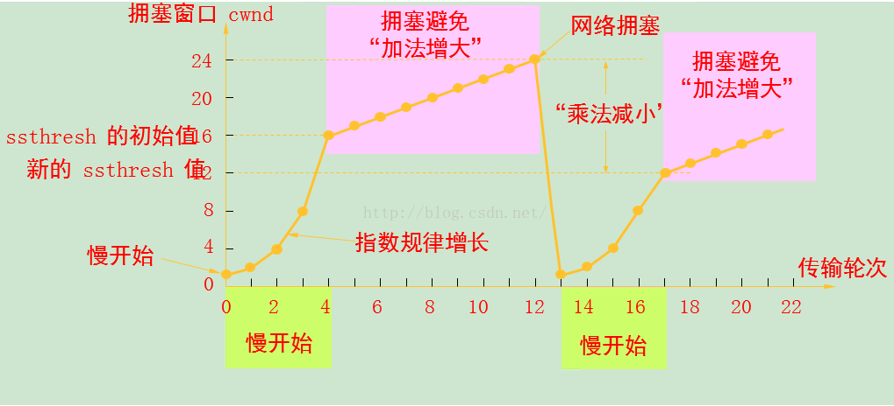

# TCP 拥塞控制

1. 慢启动（Slow Start）
2. 拥塞避免（Congestion Avoidance）
3. 快速重传（Fast Retransmit）
4. 快速恢复（Fast Recovery）

[TOC]

## 慢启动

[滑动窗口](https://blog.csdn.net/wdscq1234/article/details/52444277)可以让协议同时发送多个报文段，提高网络的通信效率。

慢启动为**发送方增加一个拥塞窗口（cwnd，congestion window）**，初始化后慢慢增加 cwnd 的值。同时也引入了**慢启动阀值（ssthresh）**，如果 cwnd 到达 ssthresh 的值，则会让 cwnd 的增长变得平滑。

1. TCP 连接初始值 cwnd = 1，此时可以传一个最大报文段（MSS）大小的数据。

2. 每当收到一个 ACK， cwnd = cwnd + 1（**线性增长**）。

   > 1. 最开始 cwnd=1，发送方只发送一个 mss 大小的数据包，在一个 rtt 后，会收到一个 ack，cwnd 加1，cwnd=2
   >
   > 2. 此时 cwnd=2，则发送方要发送两个 mss 大小的数据包，发送方会收到两个 ack，则 cwnd 会进行两次加一的操作，则也就是 cwnd+2，则 cwnd=4，也就是 cwnd = cwnd * 2
   >
   > 3. 此时 cwnd=4，则发送方要发送四个 mss 大小的数据包，发送方会收到四个 ack，则 cwnd 会加 4，则 cwnd = 8，也就是cwnd = cwnd * 2.
   >
   > 以此类推，在每次 rtt 后，cwnd 都会变成一次数据包发送前的 cwnd 的两倍，这是一个等比数列，则此等比数列的推导公式就是 cwnd(n) = cwnd(1) * 2^(n-1) .     n >= 1

3. 每当经过一个网络往返时间（Round Trip Time,RTT），cwnd = cwnd * 2（**指数式增长**）。

4. 当 cwnd >= ssthresh，就会进入“拥塞避免”。

## 拥塞避免

1. 每当收到一个 ACK 时，cwnd = cwnd + 1 / cwnd
2. 每当经过一个 RTT 时， cwnd = cwnd +1

1. 连接建立，开始传输数据，cwnd = 1 , ssthresh 的初始值为 16
2. 发送端收到一个确认后，cwnd + 1，于是可以发送 2 个数据包
3. 收到 2 个 ACK 之后，这时候 cwnd + 2 , 于是可以发送 4 个数据包
4. 收到 4 个 ACK 后，这个时候 cwnd + 4 ,于是可以发送 8 个数据包
5. 当拥塞的窗口达到 ssthresh 后，慢启动算法结束，开始进入拥塞避免算法
6. cwnd 按照一个 RTT 进行 cwnd + 1 的线性增加，假设到达 24 时，出现网络拥塞
7. ssthresh = 1/2 * cwnd = 12, cwnd = 1  继续重新执行慢启动算法
8. 同样当 cwnd = 12 时执行拥塞避免算法

## 判定网络拥塞及措施

1. 重传定时器（RTO）超时，后续的报文也没有 ACK

   1. ssthresh = cwnd / 2

   2. cwnd =1

   3. 重新进入慢启动过程

2. 收到 3 个相同的 ACK（快速重传）

   1. ssthresh = cwnd / 2

   2. cwnd = ssthresh（有些为 cwnd = ssthresh + 3）

   3. 重新进入拥塞避免阶段

   > [TCP 快速重传为什么是三次冗余 ACK](
   > https://www.zhihu.com/question/21789252/answer/110640581)
   >
   > **两次 duplicated ACK 肯定是乱序造成的，丢包肯定会造成三次 duplicated ACK!**
   >
   > A 方发送顺序
   >
   > N-1，N，N+1，N+2
   >
   > B 方到达顺序
   >
   > N-1，N，N+1，N+2 | A 收到 1 个 ACK (N)
   >
   > N-1，N，N+2，N+1 | A 收到 1 个 ACK (N)
   >
   > N-1，N+1，N，N+2 | A 收到 2 个 ACK (N)
   >
   > N-1，N+1，N+2，N | A 收到 3 个 ACK (N)
   >
   > N-1，N+2，N，N+1 | A 收到 2 个 ACK (N)
   >
   > N-1，N+2，N+1，N | A 收到 3 个 ACK (N)
   >
   > 如果 N 丢了，没有到达 B
   >
   > N-1，N+1，N+2 | A 收到 3 个 ACK (N)
   >
   > N-1，N+2，N+1 | A 收到 3 个 ACK (N)

## 快速恢复

针对快速重传的第三步，不是进入“拥塞避免”，而是进入“快速恢复”。

1. ssthresh = cwnd / 2
2. cwnd = ssthresh + 3
3. 当收到**重复的 ACK** 时，cwnd = cwnd + 1
4. 当收到**新的数据包 ACK** 时，cwnd = ssthresh
5. 重新进入拥塞避免阶段

> 1. [TCP-IP详解: 慢启动和拥塞控制](https://blog.csdn.net/wdscq1234/article/details/52517420)
> 2. [TCP慢启动、拥塞避免、快速重传、快速恢复](https://blog.csdn.net/itmacar/article/details/12278769)
